# Почему это важно?

В течение всей истории человечества изображения и карты использовались для манипуляции мнениями.

```{=html}
<iframe width="800" height="400" src="https://www.youtube.com/embed/G0_MBrJnRq0?si=tr3FCQvfY6fsZYKK" title="YouTube video player" frameborder="0" allow="accelerometer; autoplay; clipboard-write; encrypted-media; gyroscope; picture-in-picture; web-share" referrerpolicy="strict-origin-when-cross-origin" allowfullscreen></iframe>
```

В случае с картами манипулировать даже проще, чем с обычными графиками, потому что в среднем человек больше будет доверять именно карте и считать ее более надежной и объективной.

------------------------------------------------------------------------

{fig-align="center"}

# Способы визуализации пространственных данных

::: callout-warning
Отметим, что здесь мы ведем речь не о топографических картах, а о так называемых тематических картах, на которых отображается какой-то показатель.
:::

Способы отображения различных показателей на карте можно поделить на несколько больших групп:

-   карты символов;

-   картограммы;

-   карты линейных знаков;

-   картодиаграммы.

## Карты символов

Карты символов делятся на две основные группы:

-   пропорциональные или градуированные символы

-   карты плотности точек.

Карты пропорциональных символов в литературе по картографии могут еще называться картами точечных символов

------------------------------------------------------------------------

### Карта пропорциональных символов

Карта пропорциональных символов или карта точечных символов (второй термин более характерен для отечественной литературы; в некоторых источниках также может называться площадной или пузырьковой картодиаграммой) - это тип тематической карты, на которой символы различной величины показывают значение количественного показателя. Размер символа здесь напрямую зависит от величины показателя.

В качестве символов может быть использована любая простая геометрическая фигура (круг, квадрат, треугольник и т.д.) или пиктограмма.

::: callout-caution
Использование кругов влечет за собой определенные сложности для их масштабирования, так как площадь круга при увеличении изменяется нелинейно.

Джеймс Флэннери в своей диссертации оценил, насколько люди способны сравнивать между собой площади круга, что послужило основой для метода масштабирования символов, названного его именем.
:::

------------------------------------------------------------------------

{.absolute top="0" left="0" width="1100" height="900"}

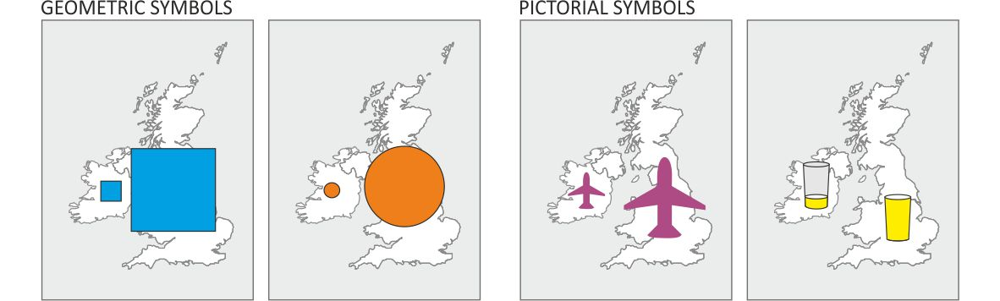{.absolute top="300" right="0" width="800" height="250"}

------------------------------------------------------------------------

{fig-align="center"}

------------------------------------------------------------------------

::: callout-important
Основной визуальной характеристикой при создании карты пропорциональных символов является размер, который может быть однозначно интерпретируемым только для количественных переменных.
:::

Пропорциональные символы **могут быть использованы для отображения абсолютных значений показателей, в которых отсутствуют отрицательные значения**.

::: callout-note
Карты пропорциональных символов позволяют комбинировать несколько визуальных переменных. Например, вы можете отобразить один показатель размером, а другой цветом или формой.
:::

---


------------------------------------------------------------------------

Размещение символов зависит от того, какие данные лежат в основе карты:

-   если исходные данные представляют собой отдельные точечные наблюдения, то символы размещаются в месте наблюдения;

-   если исходные данные отнесены к какой-то площадной единице (административного деления, например), то они размещаются в геометрическом центре этой площадной единицы. В том случае, если площадной объект представляет собой неправильные многоугольник, геометрический центр которого лежит за его пределами, то символ может быть смещен внутрь.

------------------------------------------------------------------------

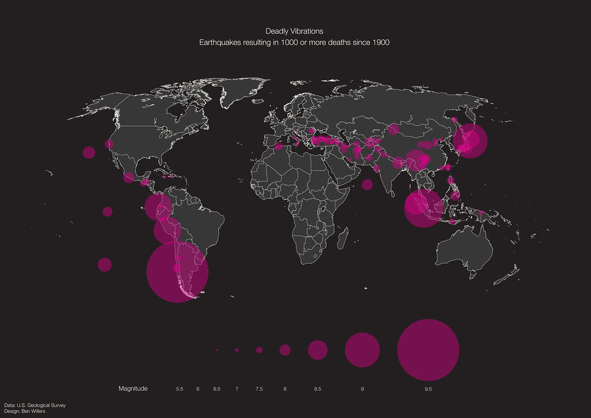{fig-align="center"}

------------------------------------------------------------------------

{fig-align="center"}

------------------------------------------------------------------------


------------------------------------------------------------------------

### Карта плотности точек

Подход отображения величины показателя с помощью скопления точек равномерно и случайным образом в пределах территориальной единицы.

{fig-align="center"}

------------------------------------------------------------------------

Самым знаменитым примером карты плотности точек является карта Джона Сноу, которая положила начало пространственному анализу, тематическому картографированию, ГИС, кластеризации и современной эпидемиологии, но на самом деле история не совсем такая, как ее обычно рассказывают[^1].

[^1]: <https://www.esri.com/arcgis-blog/products/arcgis-pro/mapping/something-in-the-water-the-mythology-of-snows-map-of-cholera/>

{fig-align="center" width="738"}

------------------------------------------------------------------------

{fig-align="center"}

------------------------------------------------------------------------

{fig-align="center" width="1789"}

------------------------------------------------------------------------

В картах плотности точек выделяют два основных типа, которые некоторыми картографами рассматриваются как радикально различные:

-   карты плотности **один-к-одному**, где каждая точка соответствует индивидуальному случаю, например, одному заболевшему

-   **один-ко-многим**, где каждая точка соответствует не индивидуальному наблюдению, а группе.

Некоторые исследователи предлагают разделить описанные два типа карт и называть карты плотности один-к-одному - картами распределения точек, а карты один-ко-многим - картами плотности точек.

------------------------------------------------------------------------

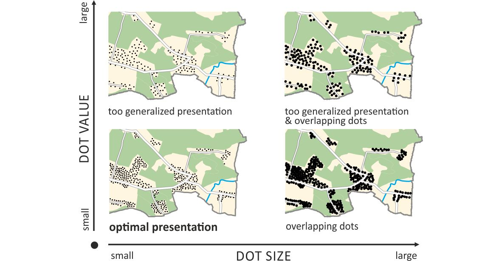{fig-align="center" width="1730"}

------------------------------------------------------------------------

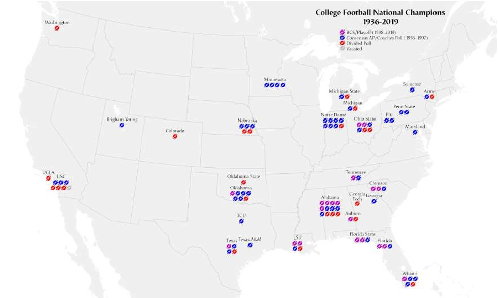{fig-align="center"}

------------------------------------------------------------------------

## Картограммы

Картограмма в терминологии картографии предполагает некое подобное карте изображение, поэтому, как правило, в них происходит либо искажение топологии (взаимного расположения объектов), либо искажение формы.

{fig-align="center" width="1365"}

------------------------------------------------------------------------

### Фоновая картограмма

В англоязычной литературе такие карты называются *choropleth* (от древнегреческого χῶρος (*khôros*) - 'область, регион' and πλῆθος (*plêthos*) - 'множество'). При этом термин "*cartogram*" существует самостоятельно и используется для того, что в традиции отечественной картографии принято называть анаморфной картой. Разница в терминологии часто приводит к неправильному переводу или неправильному названию этого типа карт в некоторых источниках.

::: callout-tip
Скорее всего эта разница может быть объяснена самим происхождением понятия "картограмма" (нем. *kartogramm*), который был предложен немецкими картографами Хааком и Вайхелем и впоследствии получил широкое применение в качестве обозначения всех тематических карт. Судя по всему, отсюда он и перешел в отечественную картографию. Но со временем американский картограф Райс и другие конкретизировали термин и он получил свое современное значение в международной терминологии.
:::

------------------------------------------------------------------------

Один из самых распространенных типов отображения географических данных - все объекты раскрашиваются или заштриховываются в зависимости от значения какого-либо показателя.

::: callout-important
Основной визуальной характеристикой здесь является яркость или цвет, текстура или штриховка используется значительно реже.
:::

В традиции отечественной картографии выделяют *методы качественного и количественного фона* в зависимости от картографируемой переменной. Так, при создании фоновой картограммы по номинальной/категориальной переменной (тип почвы, горные породы) применяется соответственно метод качественного фона (в зарубежной литературе может быть назван *хорохроматической картой*), а при количественной (плотность населения, доход, ВВП) - метод количественного фона.

------------------------------------------------------------------------

{fig-align="center"}

------------------------------------------------------------------------

"*cartes teintées*" (тонированные карты) для отображения различных видов статистических данных: образование, уровень преступности, заболеваемость, условия проживания и прочие. Например, карта заболеваемости холерой в Париже 1832 года Шарля Пике.

{fig-align="center"}

------------------------------------------------------------------------

Одной из первых карт качественного фона считается карта языковых регионов Готтфрида Гензела ([Gottfried Hensel](https://en.wikipedia.org/wiki/Gottfried_Hensel)), опубликованная им в 1741 году в работе по языкознанию **Synopsis Universae Philologiae**.

{fig-align="center" width="1121"}

------------------------------------------------------------------------

{fig-align="center"}

------------------------------------------------------------------------

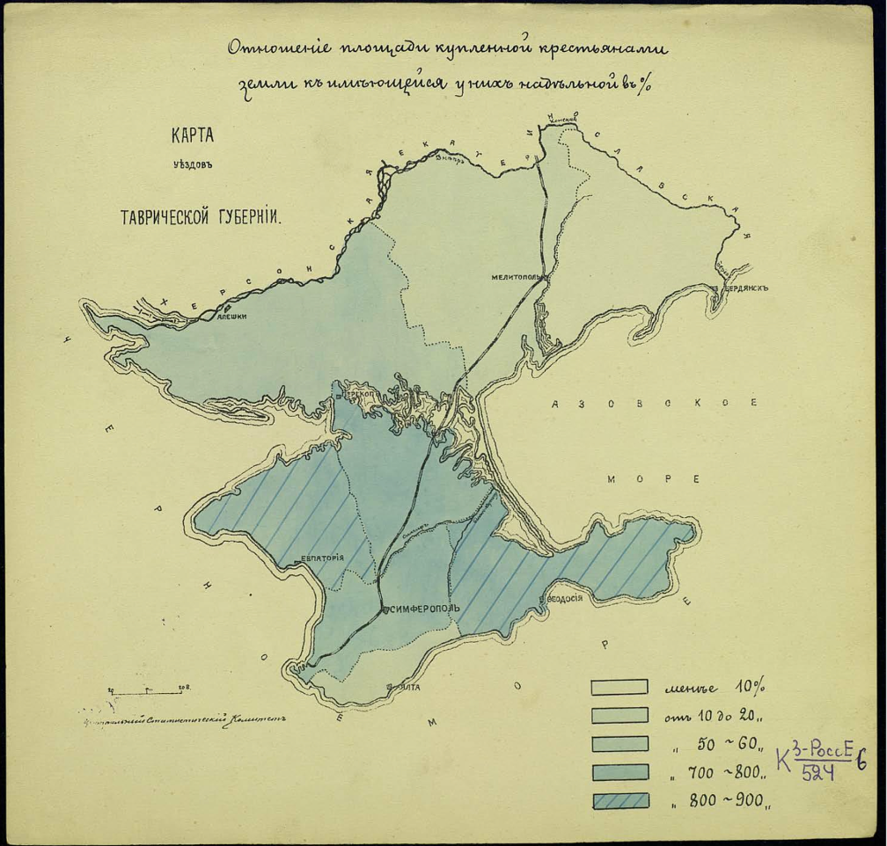{fig-align="center" width="943"}

------------------------------------------------------------------------

![Почвенная карта СССР / под ред. Л. И. Прасолова. М.: 1-я образцовая тип. им. Огиза РСФСР, \[1938?\]. 1 к. цв.; 34х27 см.](images/clipboard-3958555903.png){fig-align="center" width="1126"}

------------------------------------------------------------------------

::: callout-warning
При создании фоновых картограмм следует учитывать, что они представляют минимальную визуальную равнозначность объектов, то есть наше восприятие будет искажено формой и размером самих по себе площадных объектов.
:::

Например, административно-территориальные единицы разного размера и формы, но с одинаковым количеством населения будут иметь совершенно различные паттерны распределения этого населения по территории.

::: callout-important
В связи с этим рекомендуется нормализовывать данные.

Основными приемами нормализации являются:

-   вычисление плотности путем деления переменной на площадь территориальных единиц;

-   вычисление доли от целого;

-   вычисление средней величины на душу населения;

-   скорость изменения по отношению к предыдущему периоду времени.
:::

------------------------------------------------------------------------

### Дазиметрические карты

Дазиметрическая карта - это такой тип тематической карты, в котором используется площадная символика (заливка или штриховка) для отображения пространственно распределенной величины на основе фоновой картограммы с ее корректировкой по вспомогательным данным о пространственном распределении.

::: callout-tip
Название произошло от греческих *δασύς (dasýs)*  «плотный» и *μέτρο (métro)*  «мера». Такое название появилось благодаря тому, что такие карты, как правило создавались для отображения плотности населения.
:::

По сей день не существует четкой и формализованной методики создания дазиметрических карт, поэтому широкого распространения они не получили.

------------------------------------------------------------------------

{fig-align="center"}

------------------------------------------------------------------------

![Картограмма национального состава населения по Оренбургской области. Сост. по данным соц.-эконом. справочника «Средняя Волга» изд. 1934 г. / сост. Волж. картогр. ф-кой В.К.Т. Г.У.Г.С.К. Н.К.В.Д. 1935 г. \[Саратов: Волж. картогр. ф-ка\], 1935. 1 к. цв.; 30х48 см](images/clipboard-2094741205.png){fig-align="center" width="1218"}

------------------------------------------------------------------------

### Двухкомпонентные фоновые картограммы

*Двухкомпонентные фоновые картограммы (bivariate choropleth)* сочетают в себе сразу две цветовые шкалы для отображения комбинации двух количественных переменных.

С одной стороны, такой подход позволяет показать и проанализировать связь между двумя явлениями.

::: callout-warning
Главная сложность в том, что получается слишком неоднозначная цветовая шкала, восприятие которой затруднено.

Поэтому широкого распространения такие картограммы не получили.
:::

------------------------------------------------------------------------

{fig-align="center" width="718"}

::::: columns
::: {.column width="50%"}
{fig-align="center"}
:::

::: {.column width="50%"}
{fig-align="center"}
:::
:::::

------------------------------------------------------------------------

{fig-align="center" width="1333"}

------------------------------------------------------------------------

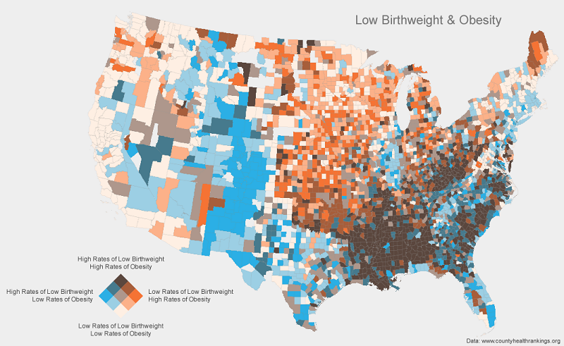

------------------------------------------------------------------------

{fig-align="center"}

------------------------------------------------------------------------

#### Лица Чернова

Впервые этот метод был предложен американским статистиком Германом Черновым в 1973 году (**Herman Chernoff, [The Use of Faces to Represent Points in K-Dimensional Space Graphically](http://links.jstor.org/sici?sici=0162-1459%28197306%2968%3A342%3C361%3ATUOFTR%3E2.0.CO%3B2-2), Journal of the American Statistical Association, vol. 68, no. 342, pp. 361–368, 1973**).

Как правило, такой способ комбинации отображения различных переменных значительно проще считывается визуально, чем цветовые сочетания или сочетания цвет-форма/размер символа, так как по своей природе человеку проще искать и воспринимать паттерны в лицах других людей.

------------------------------------------------------------------------

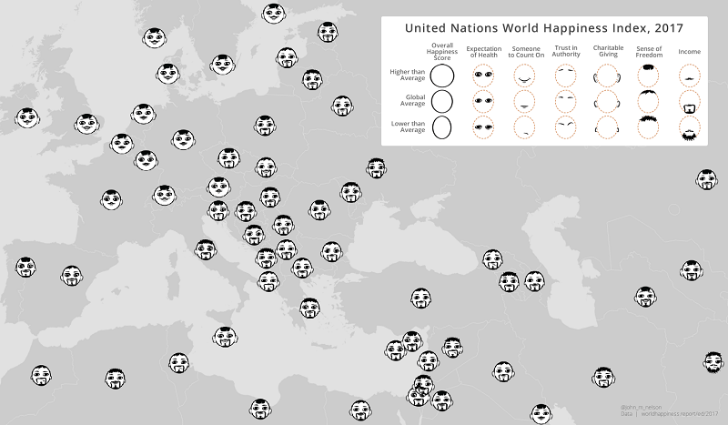{fig-align="center"}

------------------------------------------------------------------------

### Анаморфная карта (смежная картограмма)

Анаморфная (также встречается под названием анаморфированная карта или анаморфоза) карта - это пре­об­ра­зо­ван­ная *не­про­стран­ст­вен­но­по­доб­ная кар­та, из­ме­няю­щая фор­мы по­ка­зан­ных объ­ек­тов и на­прав­ле­ния*, но точ­но от­ра­жаю­щая их то­по­ло­ги­че­ские от­но­ше­ния.

В иностранной литературе такие карты, как правило, называются просто картограммами - *cartogram* или *area cartogram.*

::: callout-tip
Иногда анаморфные карты также называют картоидами, так как истинные очертания объектов заменены на геометрическую абстракцию.
:::

------------------------------------------------------------------------

{fig-align="center"}

------------------------------------------------------------------------

### Несмежная картограмма

Вариацией анаморфных карт является *несмежная картограмма* (иногда в отечественной литературе встречается термин "*топологически разорванная картограмма*", иностранный термин - *"non-contiguous cartogram"*), в которой также размер объектов изменяется пропорционально визуализируемой величине, но с некоторыми особенностями:

-   нарушается смежность объектов друг с другом;

-   изменение размера объектов происходит пропорционально с сохранением их формы

------------------------------------------------------------------------

{fig-align="center"}

------------------------------------------------------------------------

### Графические картограммы

Как правило, в таком типе карт *каждый исходный объект заменяется объектом универсальной формы, размер которого будет зависеть от величины показателя*.

Самыми распространенными являются картограмма ДеМерса и Дорлинга: первая использует квадраты, а вторая - круги.

{fig-align="center"}

------------------------------------------------------------------------

{fig-align="center" width="1374"}

------------------------------------------------------------------------

### Сеточная картограмма

*Сеточная картограмма* (также иногда встречается под названием *"мозаичная картограмма"*, иностранный же термин - *"mosaic cartogram" или "grid cartogram"*, также встречается термин *"hex grid cartogram"* для тех из них, которые используют шестиугольники) составляется из повторяющихся фигур одинакового размера (как правило, квадратов/прямоугольников или шестиугольников, так как ими можно без зазоров заполнить любую по размеру площадь на плоскости) для построения мозаичного представления переменной.

::: callout-important
Эти картограммы могут показаться похожими на карты, построенные на основе регулярной сетки. Но при использовании регулярной сетки для агрегирования каждой ячейке соответствует определенное значение величины, полученное при агрегировании, а в сеточной картограмме каждая ячейка соответствует определенному и только одному значению отображаемой переменной.
:::

------------------------------------------------------------------------

{fig-align="center"}

------------------------------------------------------------------------

{fig-align="center"}

------------------------------------------------------------------------

{fig-align="center"}

------------------------------------------------------------------------

{fig-align="center"}

------------------------------------------------------------------------

### Карта значений с альфа-каналом

Фактически такие карты представляют собой двухкомпонентные картограммы, в которых **вторая переменная задает не цвет или яркость, а насыщенность цвета.**

Поэтому отдельные объекты, имеющие большее значение будут более яркими и насыщенными, а объекты с наименьшим влиянием на результат или отображаемую величину будут затемнены. Это затемнение и уменьшение насыщенности достигается за счет вариации в прозрачности (тот самый "альфа-канал"), что позволяет добиться эффекта наложения фильтра на карту.

::: callout-note
Понятие "альфа-канал" заимствовано из компьютерной графики.

Альфа-канал действует как маска прозрачности, обеспечивая значение прозрачности каждому пикселу. Альфа-канал может быть включен или выключен для многоканальных наборов растровых данных, отображаемых с использованием метода Модель RGB (RGB Composite)[^2].
:::

[^2]: Использование альфа-канала <https://desktop.arcgis.com/ru/arcmap/latest/manage-data/raster-and-images/using-the-alpha-channel.htm>

------------------------------------------------------------------------

{fig-align="center"}

------------------------------------------------------------------------

{fig-align="center"}

------------------------------------------------------------------------

### Плиточные карты

На таких картах объекты преобразуются в объекты универсальной формы и размера (как правило, квадратные или шестиугольные), которые потом могут быть раскрашены по значениям показателей либо внутри них могут быть построены графики или приведены значения цифрами.

Плиточные карты (в иностранной литературе называемые "*tile grid maps"*) рекомендуется применять тогда, когда нужно сделать так, чтобы зритель не отвлекался на форму и размер объектов, так  как в этом случае все объекты будут выглядеть одинаково.

------------------------------------------------------------------------

::: callout-important
Главное отличие плиточной карты от графической картограммы в том, что здесь все объекты не только универсальной формы, но и одинакового размера, тогда как в графической картограмме размер варьируется в зависимости от величины отображаемого показателя.

Сеточная картограмма отличается от плиточной карты тем, что в ней каждый объект составляется из небольших ячеек универсальной формы и размера, в то время, как в плиточной карте каждый исходный объект заменяется одним универсальным объектом.
:::

------------------------------------------------------------------------

{fig-align="center"}

------------------------------------------------------------------------

{fig-align="center"}

## Карты линейных знаков

### Карты потоков

Карты потоков (*flow maps*) - это тематические карты, использующие линейные символы для отображения движения между локациями: движение людей, трафик, поставки продукции, миграции животных и прочее.

Как правило, карты потоков используют линейные символы с различной толщиной, чтобы показать объемы перемещений или передвижений между локациями, что делает их близкими к картам пропорциональных символов.

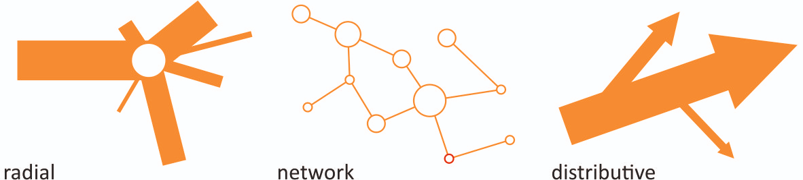{fig-align="center"}

------------------------------------------------------------------------

{fig-align="center"}

------------------------------------------------------------------------

Карты потоков показывают несколько аспектов перемещения:

-   **начало и конец передвижения**;

-   **маршрут**;

-   **что перемещается**;

-   **количество перемещаемого**;

-   **направление перемещения**;

-   **скорость перемещения**.

------------------------------------------------------------------------

{fig-align="center"}

------------------------------------------------------------------------

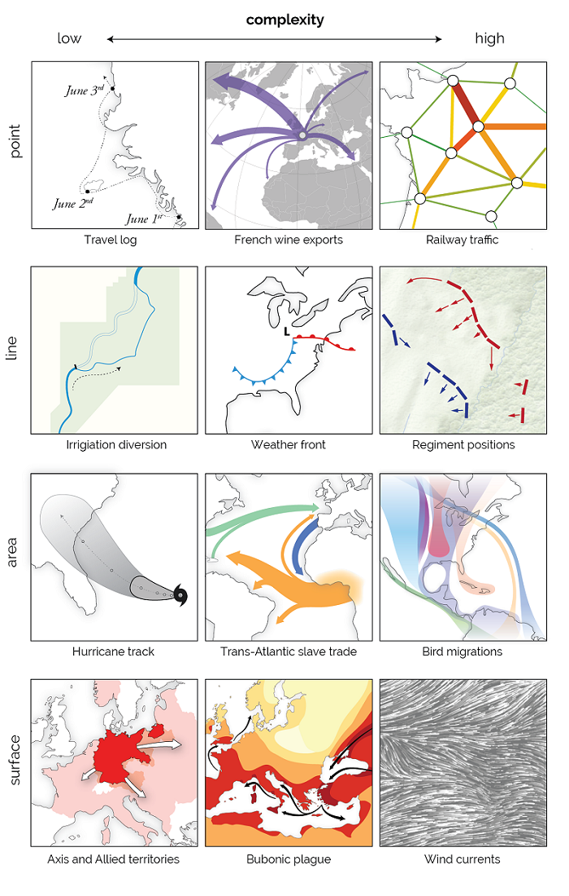{fig-align="center" width="637"}

------------------------------------------------------------------------

### Карты изолиний

**Карты изолиний** (также могут называться  **изоплетами**, **изоквантами** или **изарифмиями**) - карты, на которых отображены линии равных значений (от греческого isos - равный).

::: callout-tip
В 1889 году Френсис Гальтон предложил термин изограмма (от греческого ἴσος *(isos)* 'равный' и γράμμα *(gramma)* 'написание, рисунок') для линий, показывающих равенство физической величины или количества, однако этот термин уже использовался в лингвистике для слов, в которых не повторяется ни одна буква дважды.

В XX веке в США получил распространение термин изоплета (от греческого πλῆθος, *plethos*, 'количество'), в то время как в Европе стал использоваться термин изоритма (от греческого ἀριθμός, *arithmos*, 'число'). В нашей стране более широкое распространение получил термин "изолиния", являющийся словом гибридного греческо-английского происхождения. Также существует еще один греческо-английский термин "изометрическая линия" (от греческого μέτρον, *metron*, 'измерение').
:::

------------------------------------------------------------------------

Существует целый ряд специальных названий для изолиний в зависимости от того, какие величины они отображают:

-   изобаты - линии равной глубины;

-   изобары - линии равного давления;

-   изогипса (горизонталь) - линия равной высоты;

-   изотерма - линия равных температур;

-   изокоста - линия комбинации факторов производства, которые можно купить за одну и ту же сумму;

-   изокванта - линия одинакового объема производства продукции;

-   изохора - линия равного объема;

-   изохрона - линия равного времени.

------------------------------------------------------------------------

{fig-align="center"}

------------------------------------------------------------------------

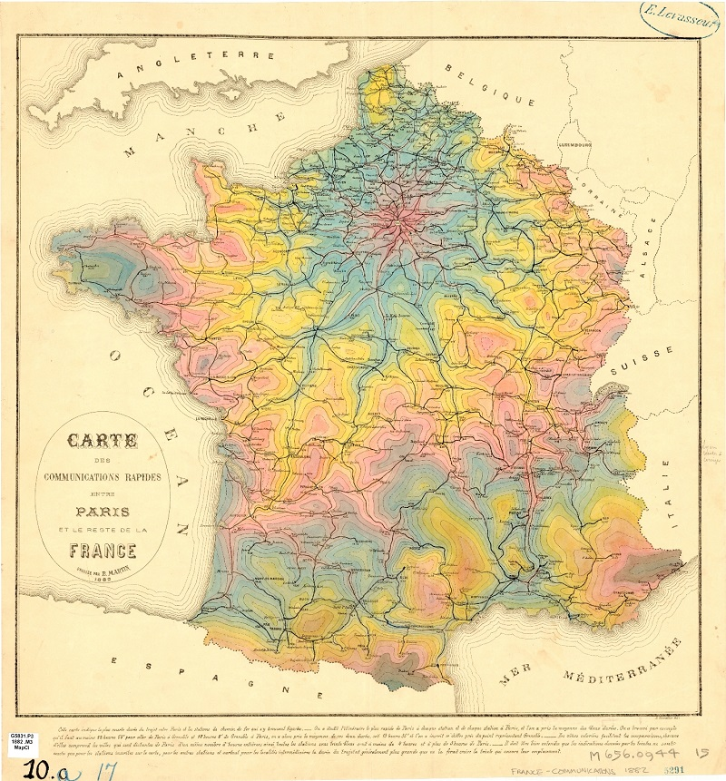{fig-align="center"}

------------------------------------------------------------------------

## Картодиаграммы

Картодиаграммы могут рассматриваться как один из случаев использования символов на карте, где вместо простых геометрических фигур или значков на карте размещаются графики.

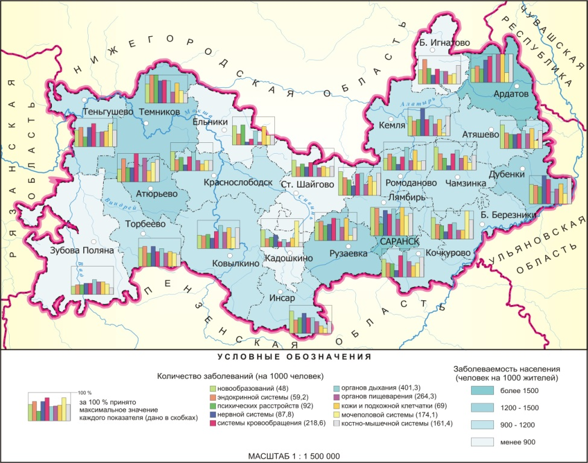{fig-align="center"}

------------------------------------------------------------------------

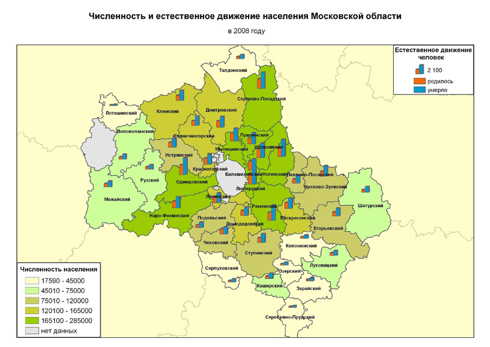{fig-align="center" width="1131"}
