**Изохроны**, как следует из их названия, - это линии равного времени, то есть они показывают области, которых можно достигнуть в течение заданного временного промежутка.

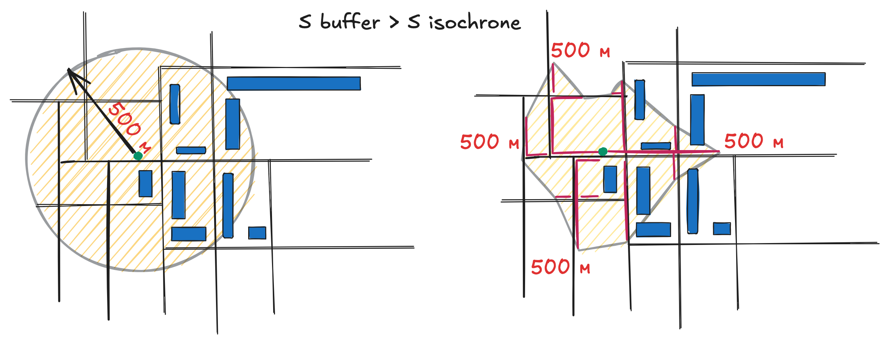{fig-align="center"}

Изохроны, как правило, применяются для оценки доступности объектов.

Построение изохрон относится к задачам сетевого анализа и построено на теории графов.

# Использование стандартных инструментов

Для сетевого анализа в **Панели инструментов анализа** есть отдельный пункт.

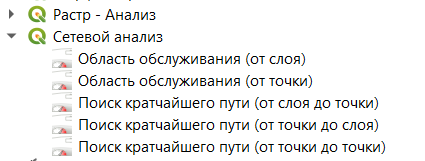{fig-align="center"}

Основные инструменты здесь - это *Область обслуживания* и *Поиск кратчайшего пути*.

За построение изохрон здесь отвечает *Область обслуживания*.

Доступно два варианта построения области обслуживания: от слоя (то есть от объектов точечного слоя) и от точки (то есть от одной заданной пользователем точки).

При построении области обслуживания от слоя самыми важными характеристиками являются:

-   *слой, отображающий улично-дорожную сеть;*

-   *слой, содержащий точечные объекты*, для которых строится область обслуживания (могут использоваться не все объекты слоя, а только выделенные);

-   *travel cost* - расстояние или время для определения области обслуживания. Расстояние задается, если выбран кратчайший путь, время (в часах), если выбран наиболее быстрый путь.

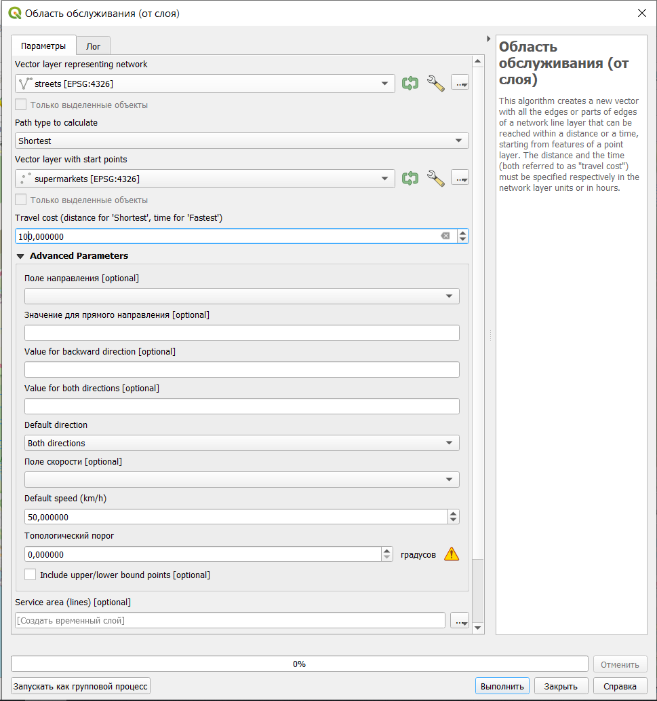{fig-align="center"}

::: callout-caution
Будьте внимательны: время нужно указывать в **часах**, а расстояние - в единицах измерения системы координат вашего слоя улично-дорожной сети.
:::

В качестве дополнительных параметров могут быть заданы:

-   *поле направления* - поле, в котором указано, в каком направлении можно передвигаться по определенному сегменту (в случае, если есть информация о том, какие улицы являются одно- или двухсторонними и в каком направлении по ним можно передвигаться);

-   *значение для прямого направления, для обратного направления и для обоих направлений* - какие значения в этом поле соответствуют каким направлениям;

-   *направление по умолчанию* - если граф является направленным и по нему можно передвигаться только в одном из направлений (по умолчанию по графу можно передвигаться в обоих направлениях);

-   *поле скорости* - поле, в котором указана скорость передвижения по конкретным сегментам сети;

-   *скорость по умолчанию* - скорость, с которой можно передвигаться по сети, если не задано поле скорости со значениями для каждого сегмента.

В результате выполнения могут быть получены два варианта результата: слой с линиями, в который входят сегменты сети, попадающие в область обслуживания, и слой с узлами, в который включаются все узлы сети, попадающие в область обслуживания и узлы, показывающие крайние точки области обслуживания (по умолчанию этот слой пропускается).

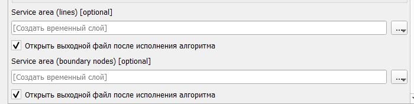{fig-align="center"}

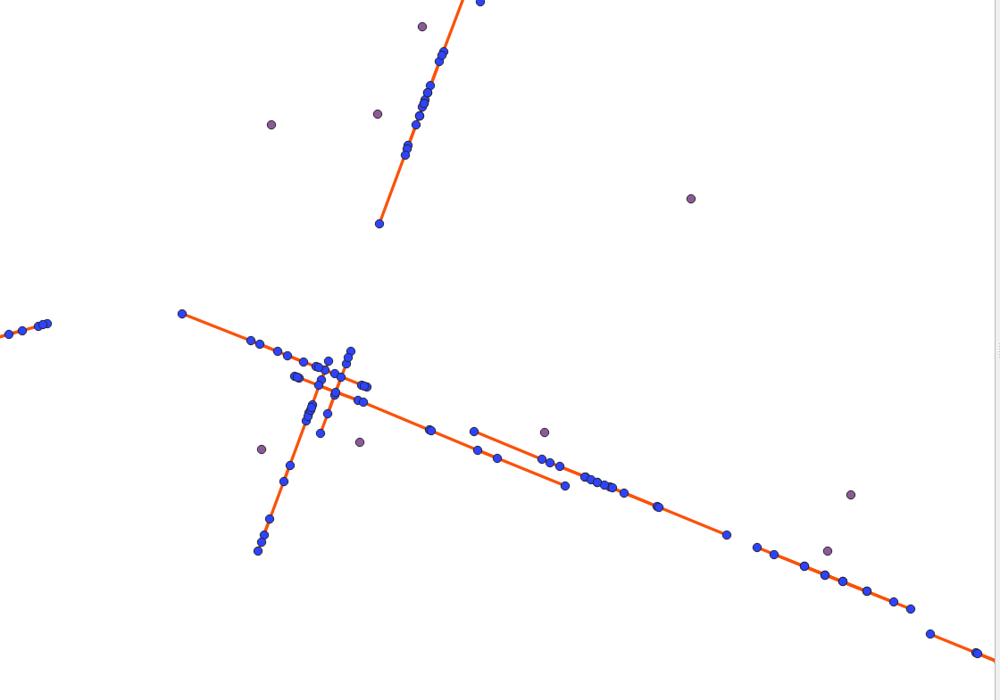{fig-align="center"}

Область обслуживания для точки рассчитывается аналогично за исключением того, что вместо слоя нужно указать положение исходной точки. Это можно сделать введя ее координаты или просто указав на карте.

# Использование модуля QNEAT3

Один из плагинов, который использует для сетевого анализа задаваемый пользователем граф улично-дорожной сети - это плагин **QNEAT3 - QGIS network analysis toolbox**. После установки плагина он должен появиться в панели инструментов анализа.

Основные функции этого плагина:

-   построение матриц времени - origin-destination matrix;

-   построение изохрон в нескольких вариациях;

-   поиск кратчайшего пути между точками.

Построение изохрон в плагине QNEAT3 возможно в нескольких вариациях от одной точки или от объектов точечного слоя:

-   линии равного расстояния (равного времени);

-   поверхность интерполяции времени или расстояния;

-   облако точек с характеристиками времения или расстояния;

-   полигональные объекты.

::: callout-warning
К сожалению, на данный момент в последних версиях программы функция построения изохрон не работает.

Если у вас более ранняя версия, то возможно модуль у вас будет работать корректно.
:::

::: callout-important
Для корректной работы алгоритмов расчета изохрон в этом плагине рекомендуется применять только плоские прямоугольные системы координат (системы координат с единицами измерений в метрах), поэтому исходные слои нужно перепроецировать в такую систему координат.
:::

Дальнейшие расчеты изохрон следует уже делать с использованием перепроецированного слоя улично-дорожной сети.

Построение изохрон от одной точки и от объектов точечного слоя отличается только параметрами на входе и получаемым в результате количеством изохрон, поэтому далее будет рассмотрено построение изохрон от одной точки. Исходная точка может задаваться либо просто кликом на карте, либо ее можно задать по координатам.

При построении изохрон в виде линий равного расстояния или времени нужно задать:

-   слой улично-дорожной сети;

-   стартовую точку;

-   размер области, в пределах которой осуществляется расчет (расстояние или время в зависимости от критерия оптимизации);

-   интервал между линиями;

-   размер ячейки растра, получаемого в результате интерполяции;

-   критерий оптимизации

    -   кратчайшее расстояние - оптимизация по расстоянию, в этом случае размер области и интервала задается в единицах измерения системы координат слоя;

    -   наиболее быстрый путь - оптимизация по времени, в этом случае размер области и интервал задается в секундах.

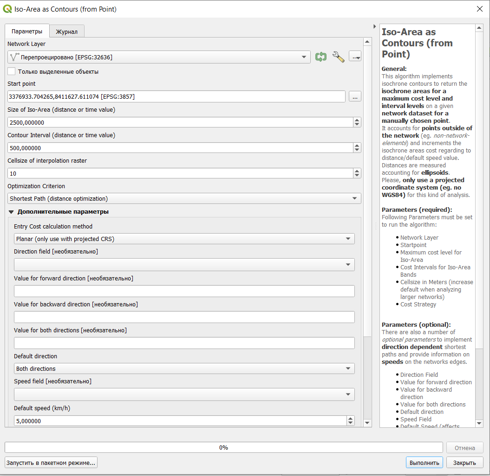{fig-align="center"}

Остальные параметры являются дополнительными и аналогичны рассмотренным выше.

Результатом расчета в этом случае будет являться два новых слоя: растр с результатами интерполяции и слой с контурами равного расстояния или времени (в зависимости от выбранного критерия оптимизации).

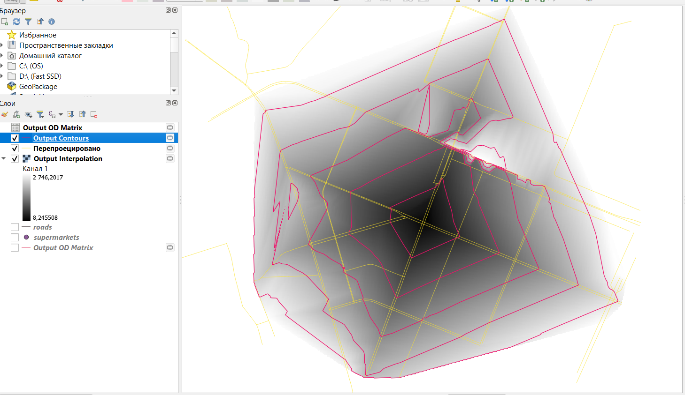{fig-align="center"}

В центре полученного растра и контуров находится исходная точка.

Результирующий растр показывает более сглаженные промежуточные значения, которые получаются на основе интерполяции значений между контурами.

Такой же растр получается при расчета изохрон только в виде растровой поверхности (Iso-area as interpolation).

Построение изохрон как облака точек по параметрам аналогично рассмотреному выше построению в виде линий равного времени или расстояния с небольшими исключениями: здесь указывается только общий размер области, а также можно выбрать метод расчета расстояния (по эллипсоиду или на плоскости).

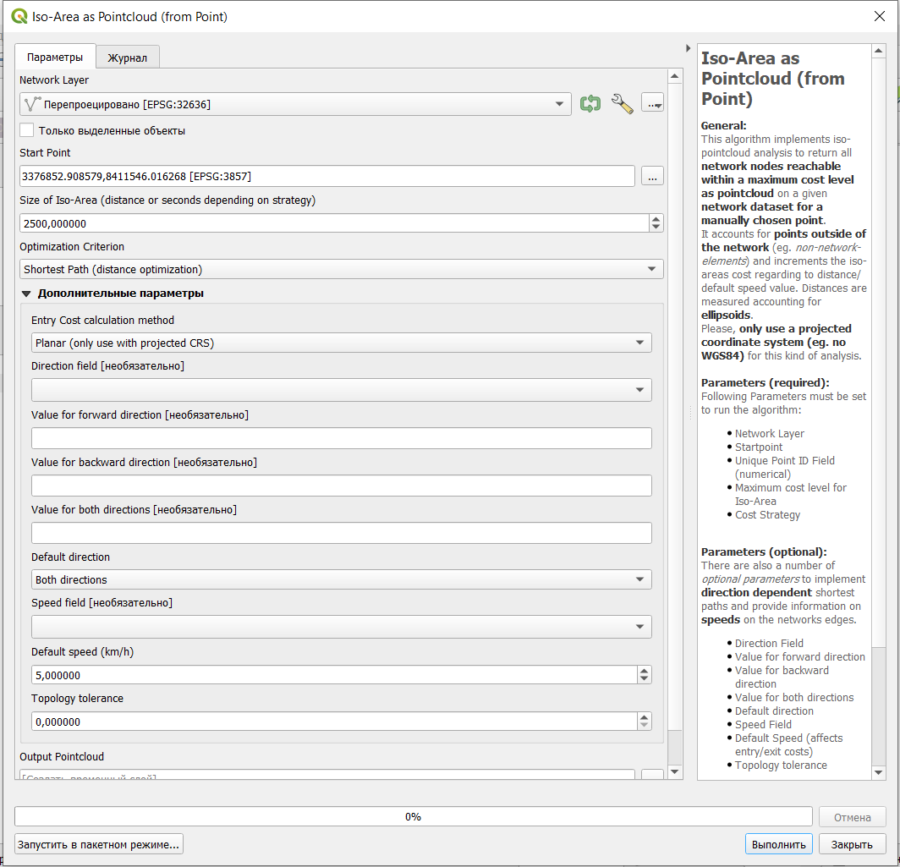{fig-align="center"}

В результате получается слой, содержащий в себе все узлы улично-дорожной сети, каждому из которых присвоен атрибут расстояния (или времени в зависимости от параметра оптимизации).

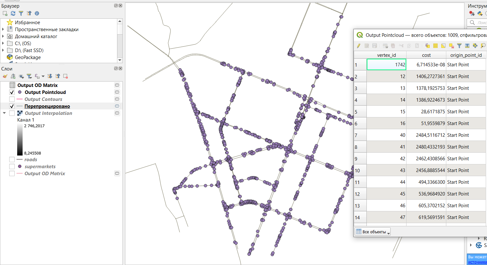{fig-align="center"}

Построение изохрон в виде полигональных объектов аналогично построению изохрон в виде линий равного времени/расстояния, только в результате вами будут получены не линейные объекты, а площадные со значениями времени или расстояния (в зависимости от выбранного критерия оптимизации).

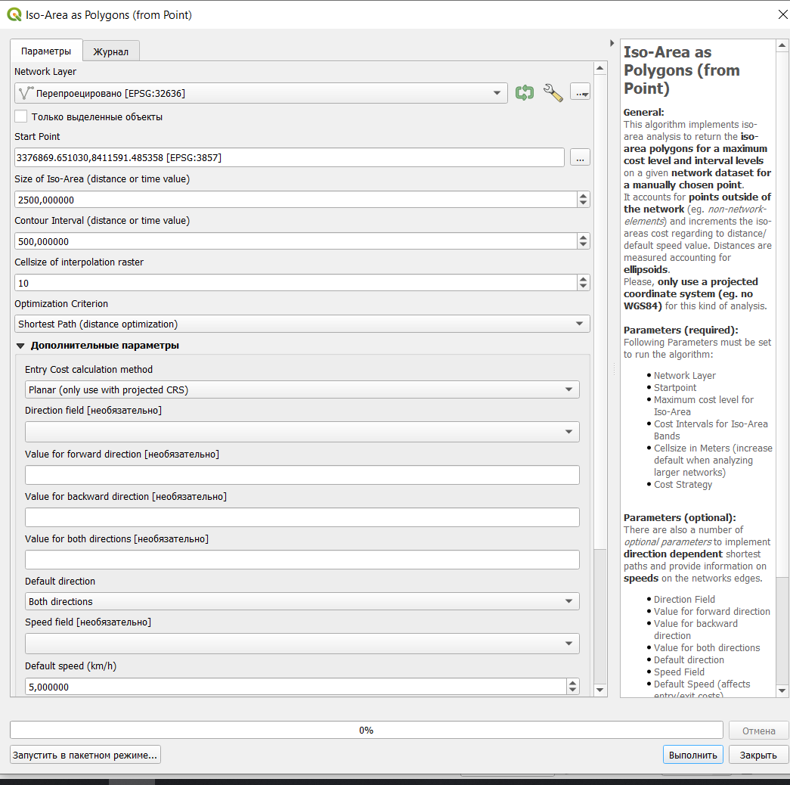{fig-align="center"}

В результате как и при построении изохрон в виде линий равного времени/расстояния получается два слоя: растровый слой с результатами интерполяции и векторный слой с полигональными объектами.

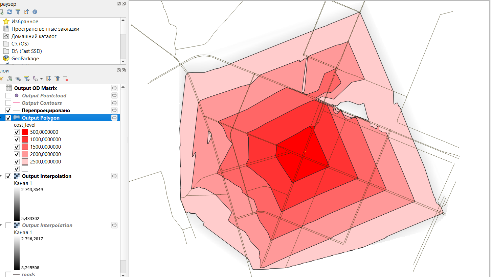{fig-align="center"}

# Использование сервиса OpenRouteService

Страница сервиса с документацией: <https://openrouteservice.org/>

OpenRouteService - это бесплатный сервис на основе OSM, который позволяет решать некоторые задачи сетевого анализа, в том числе строить изохроны.

::: callout-note
Работает этот сервис через API (Application Programming Interface) — это контракт, который предоставляет программа. «Ко мне можно обращаться так и так, я обязуюсь делать то и это»[^1].

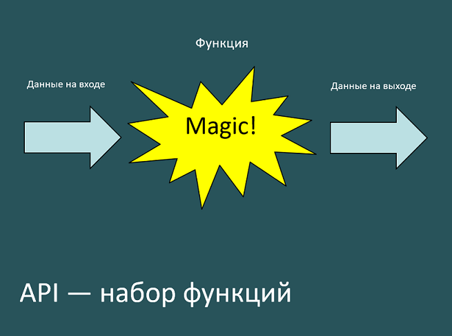{fig-align="center"}
:::

[^1]: **Что такое API** <https://habr.com/ru/articles/464261/>

Для работы с ним вам нужно установить модуль *ORS tools*.

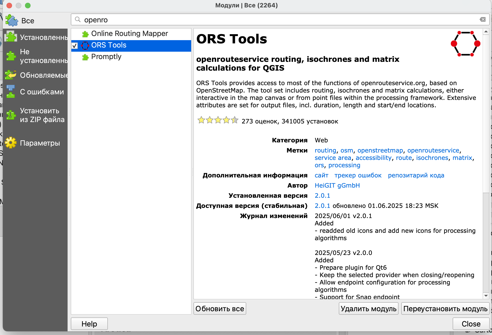{fig-align="center" width="1171"}

Этот модуль должен будет появиться у вас в панели инструментов в виде значка {width="61"}.

::: callout-important
Перед тем, как начать работу с сервисом, вам в настройках модуля необходимо прописать ваш личный API ключ, по которому программа будет опознавать вас как пользователся и осуществлять необходимые операции.

Для получения ключа вам нужно зарегистрироваться на сайте <https://openrouteservice.org/> и в своем личном кабинете найти этот ключ. Его необходимо скопировать.

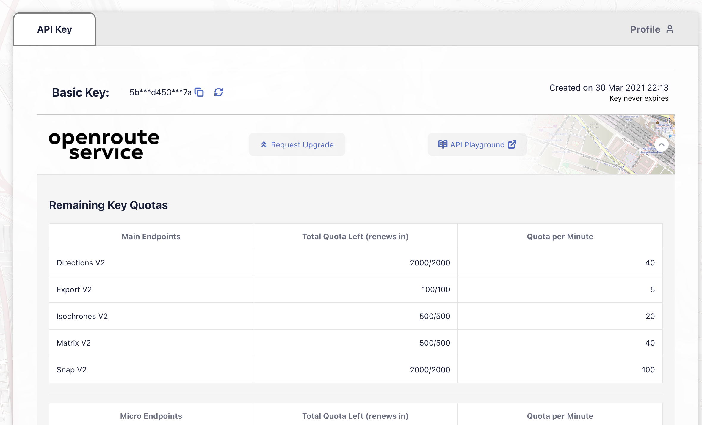{fig-align="center" width="727"}

Далее нужно открыть модуль и настройки провайдера по кнопке {width="56"}.

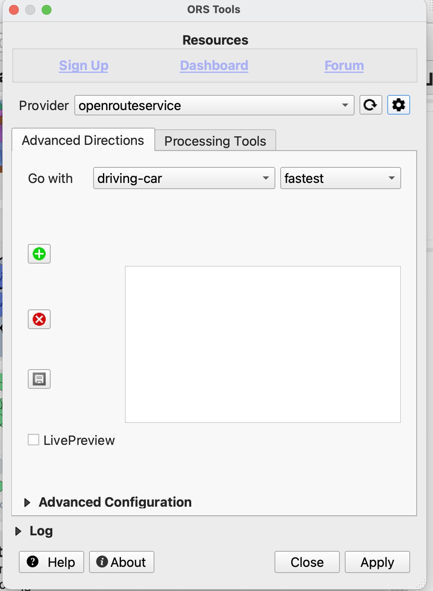{fig-align="center" width="587"}

В настройках нужно вставить ваш ключ в строку *API key* и сохранить их.

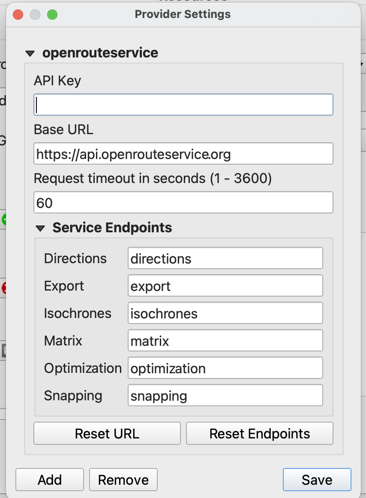{fig-align="center" width="514"}
:::

После настройки доступа к сервису вы можете перейти во вкладку *Processing tools*, из которой можно запустить процесс создания изохрон.

Изохроны здесь могут быть созданы в двух вариантах: из одной точки или из точечного слоя.

В качестве параметров построения вы можете указать:

-   *travel mode* - способ передвижения;

-   *input point/layer* - исходная точка или исходный точечный слой;

-   *dimension* - рассчитываемый параметр (время или расстояние);

-   *comma-separated ranges* - интервалы для построения изохрон: время в минутах или расстояние в метрах (зависит от рассчитываемого параметра);

-   *location type* - тип точки: исходная или конечная.

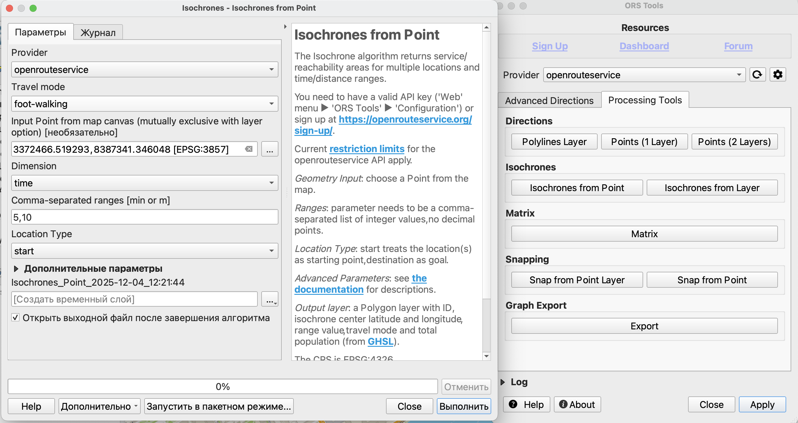

В качестве результата вы получите полигоны изохрон.

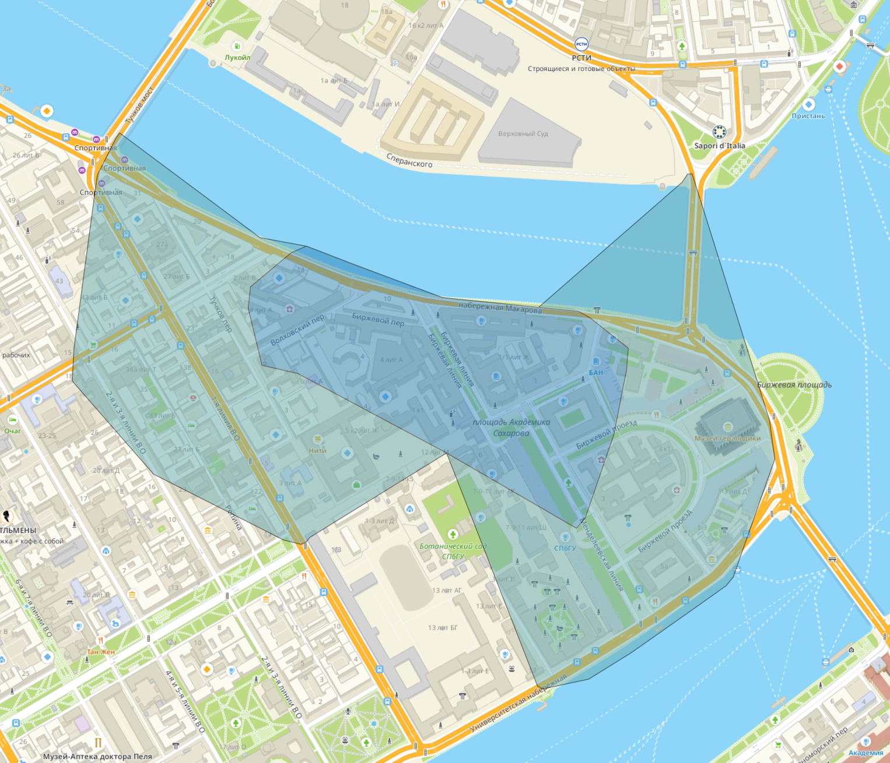{fig-align="center" width="932"}

::: callout-important
Недостатком использования подобных сервисов является то, что вы не знаете точно, какой именно граф улично-дорожной сети применяется в качестве исходного для расчета.
:::
