::: callout-note
Просто сохранить карту в виде изображения можно через строку меню *Проект* $\longrightarrow$ *Импорт/Экспорт* $\longrightarrow$ *Экспортировать карту как изображение (Экспортировать карту в PDF).*

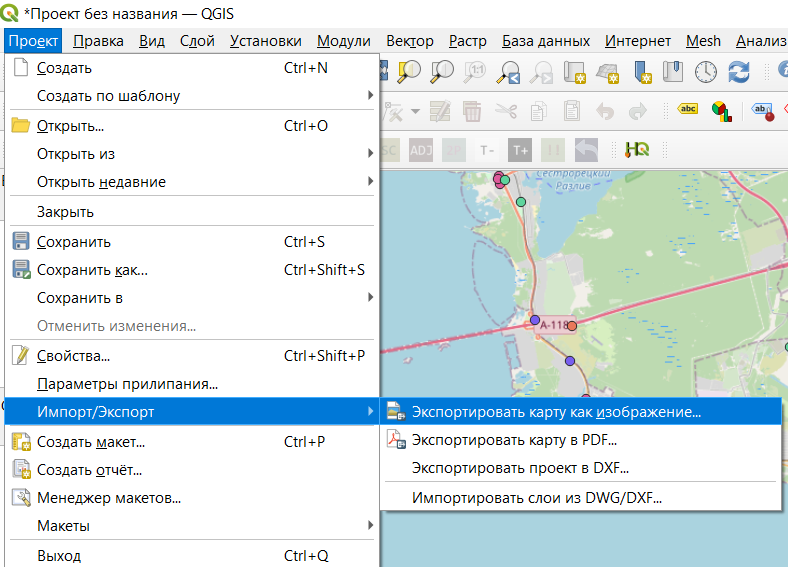{fig-align="center" width="834"}

В открывшемся окне можно настроить масштаб, охват карты, разрешение, аннотации и прочее. Но такой метод не позволяет сделать некоторые точные настройки экспорта.

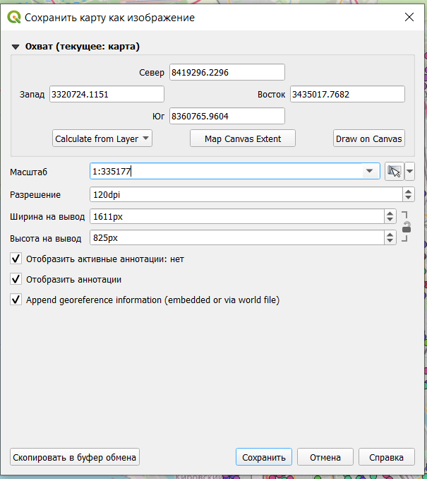{fig-align="center" width="535"}

Некоторые настройки оформления можно добавить через пункт меню *Вид* $\longrightarrow$ *Оформление*.

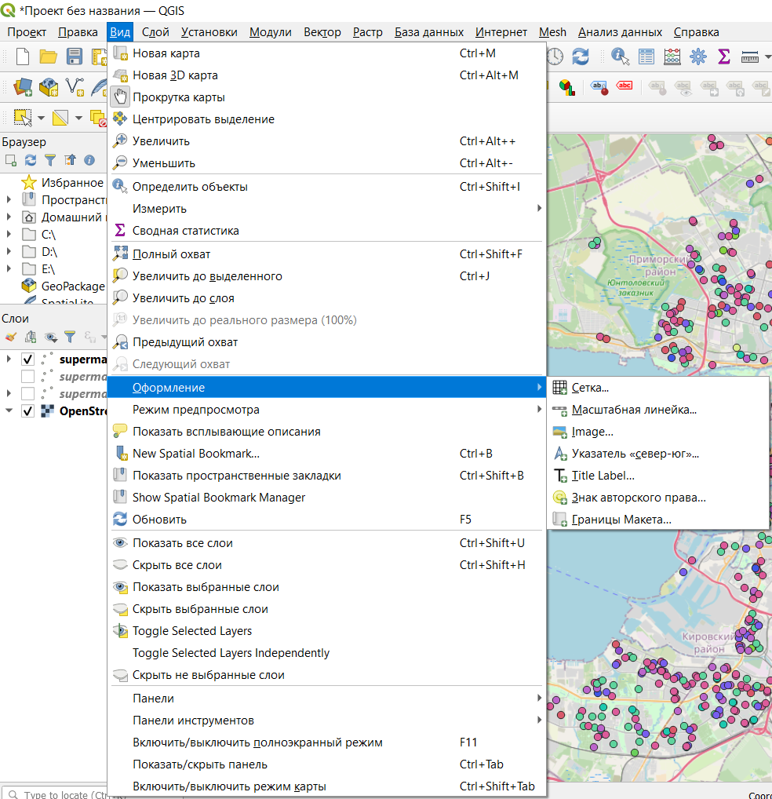{fig-align="center" width="773"}
:::

# Создание макета

Более предпочтительным методом публикации являются макеты, которые сохраняются как часть проекта и позволяют кастомизировать результат публикации. Создание макета происходит через строку меню *Проект* $\longrightarrow$ *Создать макет*.

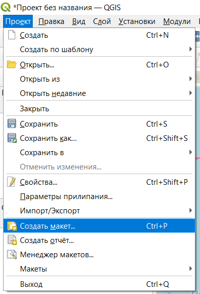{fig-align="center" width="339"}

На этом этапе вам предлагают дать имя вашему макету, вы можете оставить поле пустым, тогда имя будет присвоено автоматически.

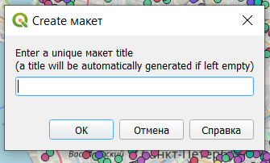{fig-align="center" width="332"}

После создания макета открывается отдельное окно, в котором происходит настройка карты для публикации.

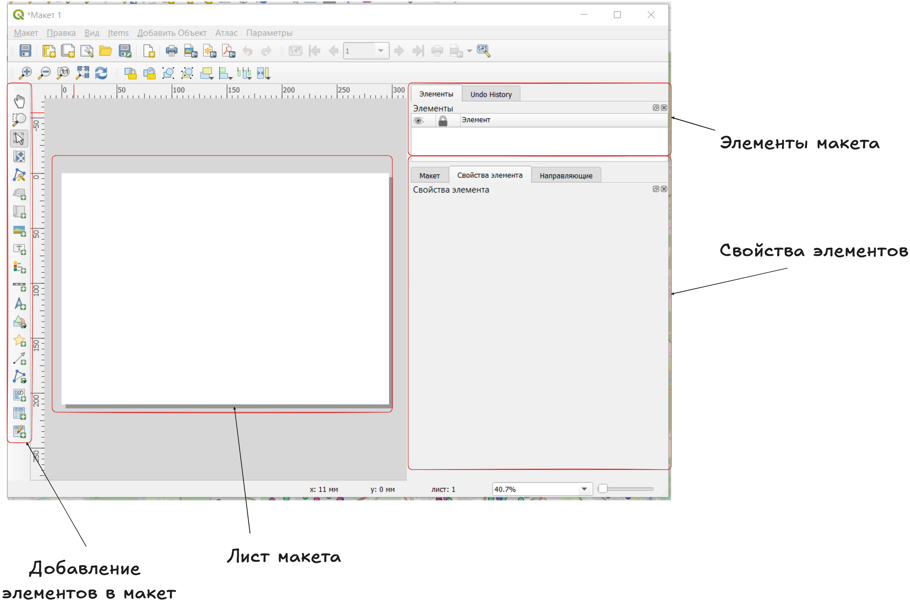{fig-align="center" width="1346"}

По левому краю расположены значки добавления различных элементов оформления на макет, в правой части окна сверху будут перечислены добавленные на макет элементы, а в правой нижней части окна будут отображаться свойства элементов. В центральной части расположен лист, на котором будет размещаться карта и добавленные на нее элементы.

## Параметры листа

Чтобы настроить размер и ориентацию листа, нужно открыть его параметры. Параметры листа открываются в контекстном меню, которое появляется после нажатия правой кнопкой мыши на лист.

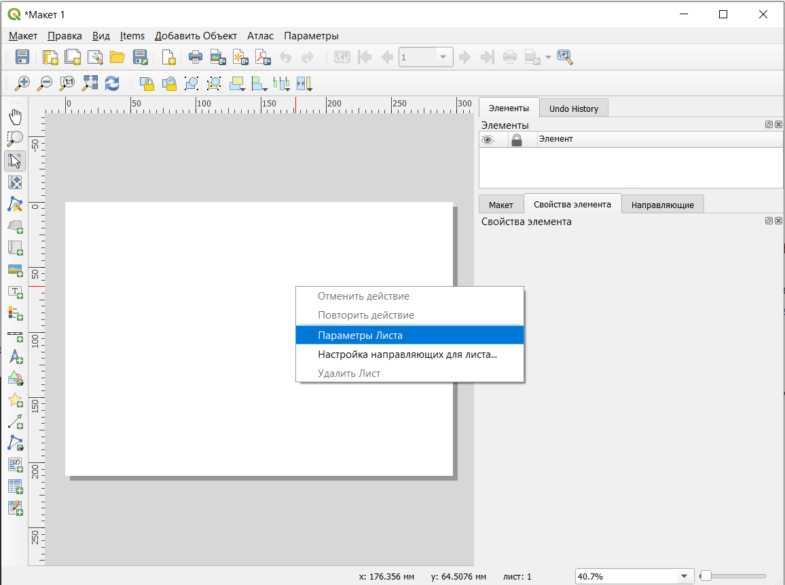{fig-align="center" width="1206"}

После этого в правой части окна появятся настройки параметров листа.

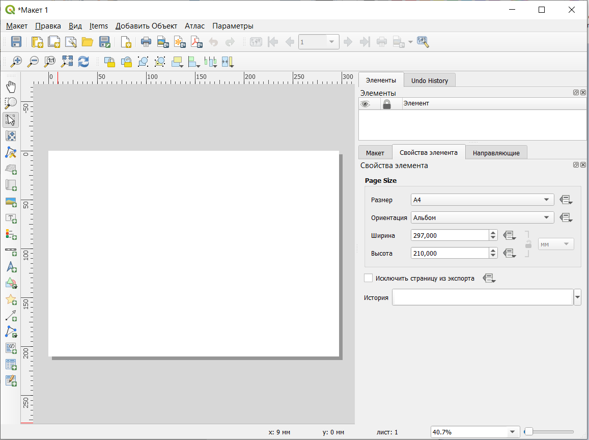{fig-align="center" width="1205"}

Добавить новый лист в макет можно кнопкой *Добавить листы.*

## Добавление карты

Добавление карты на лист осуществляется инструментом **Добавить Карта** на левой панели окна макета 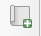.

После выбора этого инструмента нужно щеклнуть на любом месте листа, чтобы карта была добавлена. После этого открывается диалоговое окно, в котором можно настроить положение и размер элемента (не обязательно, так как это положение и размер можно скорректировать вручную уже на листе после добавления).

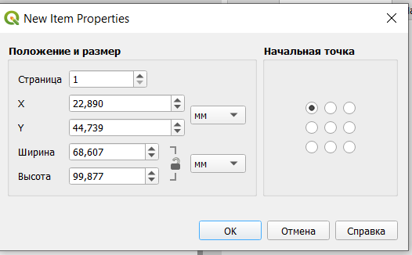{fig-align="center" width="484"}

После добавления карта должна появиться на листе, а в правой части окна появятся ее настройки.

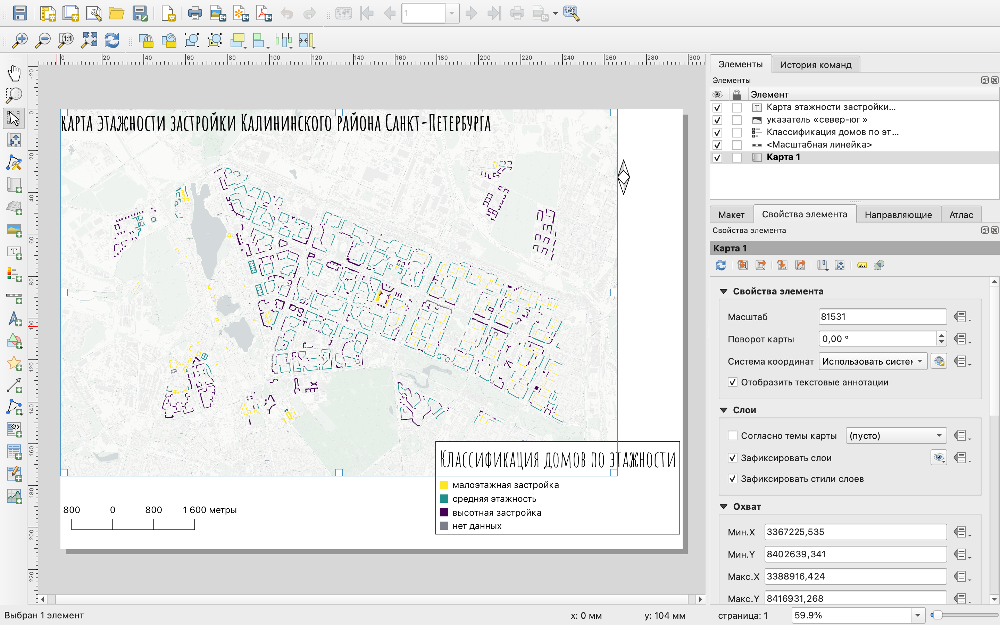{fig-align="center" width="1440"}

Изменить размер элемента можно просто потянув за один из белых квадратиков по периметру элемента. При этом можно увидеть, что сразу меняется масштаб и границы карты.

::: callout-note
На добавленной карте отображаются те слои, которые в данный момент являются видимыми в основном окне программы.
:::

Основные настройки элемента:

-   масштаб - рассчитывается в зависимости от того, какая область попадает в элемент, при необходимости может быть введен нужный знаменатель масштаба;

-   поворот карты - угол поворота, задаваемый в градусах по часовой стрелке относительно направления на север;

-   система координат - система координат, в которой карта отображается на макете, по умолчанию система координат проекта;

-   зафиксировать слои - фиксация содержания карты;

-   зафиксировать стили слоев;

::: callout-note
Содержание карты обновляется в соответствии с изменением содержания основного окна карты. То есть при включении/выключении слоев, у вас будет меняться карта на макете. Если вы не хотите, чтобы этого происходило, вы можете зафиксировать слои, то есть перечень видимых на макете слоев.

Фиксация стилей проихсодит аналогично, но замораживает не содержание карты, а оформление слоев на макете.
:::

-   границы помогают задать охват карты.

## Масштабная линейка

Для отображения масштаба карты на нее нужно добавить масштабную линейку (линейный масштаб) с помощью инструмента *Добавить Масштабная линейка* 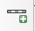

Процесс добавлени происходит аналогично добавлению карты на лист.

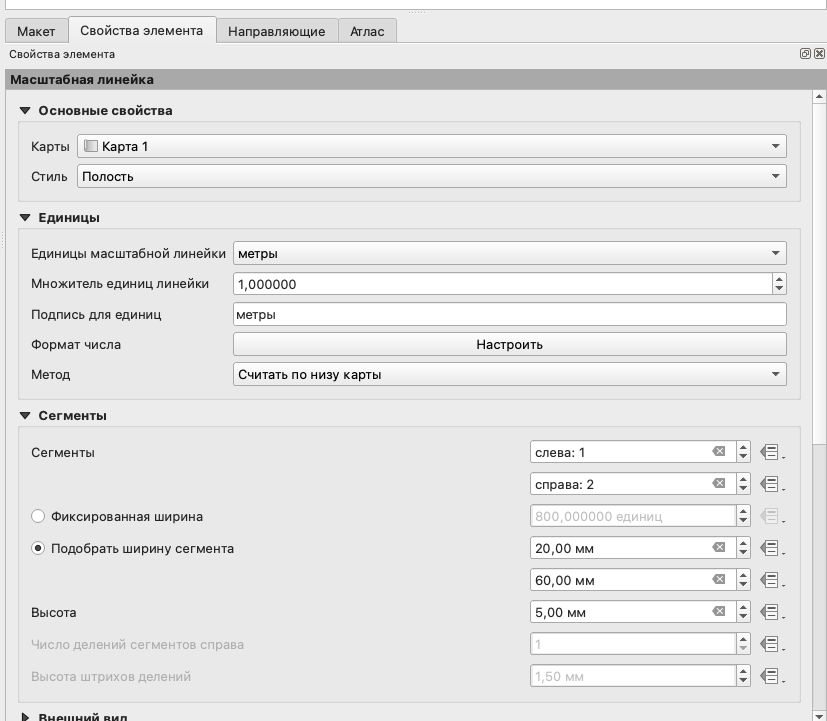{fig-align="center" width="803"}

Основные настройки масштабной линейки:

-   карта - то, для какого элемента карты добавляется линейка (в нашем случае всего один элемент карты, если их несколько можно сделать выбор);

-   стиль линейки

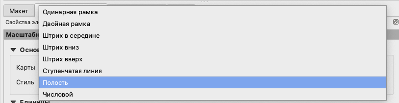{fig-align="center" width="969"}

-   единицы масштабной линейки - единицы измерения на линейном масштабе;

-   множитель единиц масштабной линейки - во сколько раз уменьшить значения на масштабной линейке;

-   подпись единиц измерения;

-   формат числа - формат чисел на линейном масштабе;

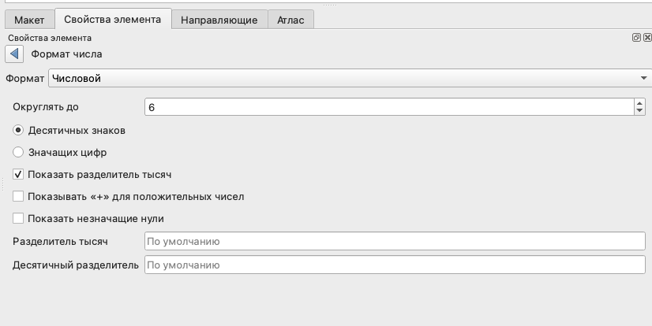{fig-align="center" width="798"}

-   сегменты - количество сегментов слева от нуля и справа от нуля;

-   фиксированная ширина - размер сегмента в единицах измерения карты;

-   подобрать ширину сегмента - размер сегментов линейного масштаба в единицах измерения листа.

## Легенда

Добавим на карту легенду, с помощью кнопки *Добавить Легенда* 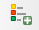.

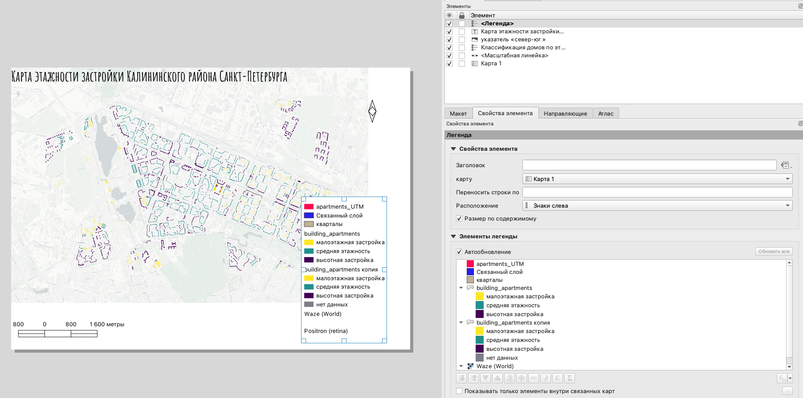{fig-align="center" width="1813"}

По умолчанию на легенду добавляются все слои, которые есть в вашем проекте. Чтобы в легенде отображались только видимые слои, нужно поставить галочку в чекбоксе **Показывать только элементы внутри связанных карт**.

Названия слоев и категорий в легенде отображаются также, как и в основном окне программы, поэтому, чтобы кастомизировать содержание легенды, нужно убрать галочку напротив функции **Автообновление** и после этого осуществить необходимые настройки.

::: callout-note
Ненужные для отображения элементы легенды вы можете просто скрыть.
:::

Вы можете подобрать нужный вам шрифт и его размер для каждого типа элементов легенды:

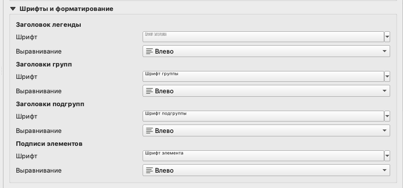{fig-align="center" width="859"}

-   заголовок легенды;

-   заголовки групп - при наличии групп слоев здесь вы можете настроить шрифт для них;

-   заголовки подгрупп - шрифт для названий слоев;

-   подписи элементов - подписи элементов легенды.

Если ваша легенда получилась слишком длинной, вы можете разбить ее на несколько колонок.

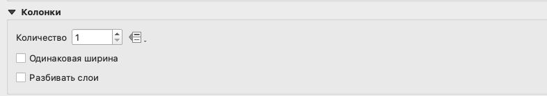{fig-align="center" width="848"}

Здесь может быть настроено нужное вам число колонок, необходимость их одинаковой ширины (по самой широкой из полученных колонок). Опция *Разбивать слои* здесь необходима в том случае, если вы хотите разбить легенду одного слоя на несколько колонок; если вы не поставите здесь галочку в чекбоксе, то колонки будут разбиваться по слоям.

Отдельно вы можете настроить заливку фона и рамку дл вашей легенды или убрать их совсем.

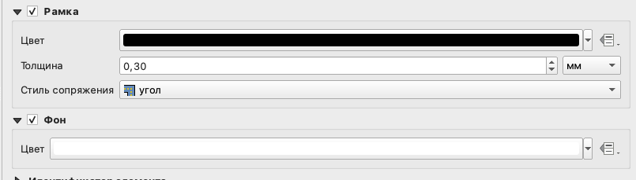{fig-align="center" width="879"}
