***Обеспеченность населения объектами*** - *количественная характеристика* сети объектов социальной, транспортной коммунальной инфраструктур, объектов благоустройства. Обеспеченность населения объектами рекомендуется рассчитывать, *как удельную мощность (вместимость, емкость, пропускная способность и т.д.) какого-либо вида инфраструктуры, приходящуюся на одного жителя или представителя определенной возрастной, социальной, профессиональной группы либо на определенное число (сто, тысячу и т.д.) жителей или представителей указанных групп*.[^1]

[^1]: Приказ Минэкономразвития России от 15.02.2021 N 71 "Об утверждении Методических рекомендаций по подготовке нормативов градостроительного проектирования" <https://www.consultant.ru/document/cons_doc_LAW_379662/>

***Территориальная доступность*** - *пространственная характеристика* сети объектов социальной, транспортной коммунальной инфраструктур. Территориальную доступность *рекомендуется рассчитывать либо исходя из затрат на достижение выбранного объекта (как правило, затрат времени), либо исходя из расстояния до выбранного объекта, измеренного по прямой, по имеющимся путям передвижения, или иным образом*.

::: callout-important
*Доступность - это метрика расстояния*, то есть насколько близко/далеко находится услуга или сервис. Например, есть ли в пределах 15-минутной доступности от дома школа или детский сад.

*Обеспеченность - это то, какой процент населения или конкретной демографической группы может воспользоваться сервисом/услугой* с учетом его емкости или сколько мест в школе приходится на 1000 человек населения.
:::

# Исходные данные

- жилые дома (можно воспользоваться уже имеющимися у вас данными или скачать новые) - для оценки количества жителей;

- объекты сервиса (детские сады или школы; также можете взять уже имеющиеся у вас данные или создать новые) - для расчета обеспеченности.

Для объектов сервиса обязательно нужно будет создать атрибут `capacity` (вместимость или мощность объекта) - количество людей, которое сервис может обслужить.

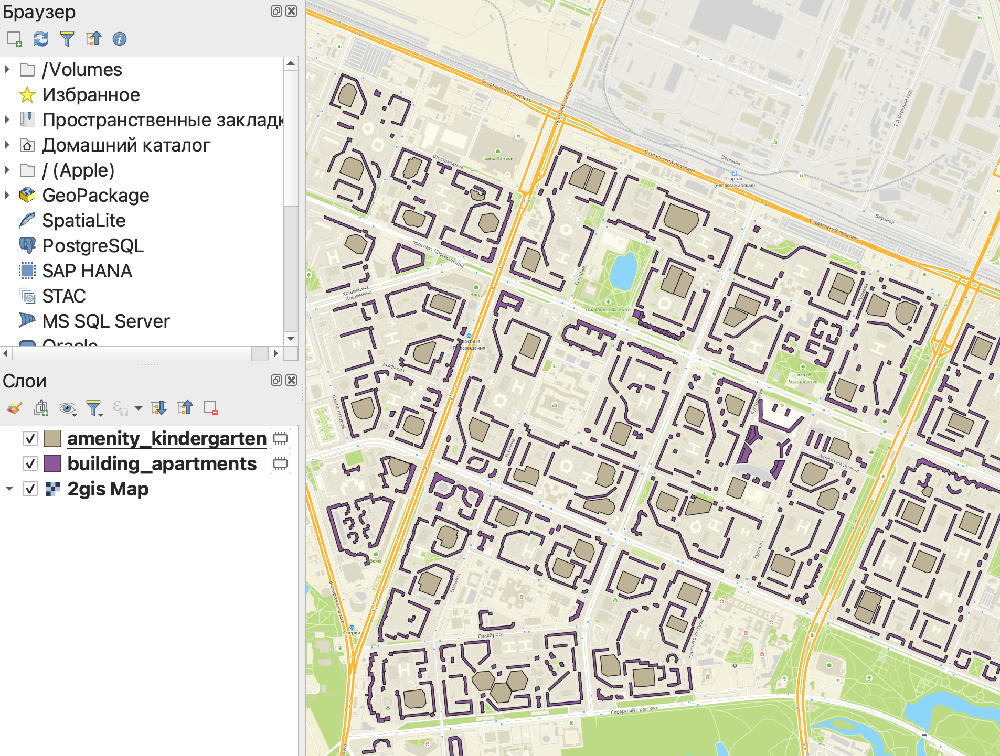

В этой работе будет сразу собрана геомодель для расчета доступности и обеспеченности населения сервисами.

Заполним атрибут `capacity`, исходя из усредненного норматива вместимости:

- для детских садов - 200 мест[^2];

- для школ - 1000 мест[^3].

[^2]: Детские ясли-сады следует проектировать на 1, 2, 4, 6, 8, 10, 12 и 14 групп или, соответственно, не более чем на 25, 50, 95, 145, 195, 240, 290 и 340 мест. - **СНиП Н-64-80. Детские дошкольные учреждения/Госстрой СССР. — М.: Стройиздат, 1981.— 15 с**

[^3]: Количество ученических мест в типовых проектах зданий школ и школ-интернатов следует принимать не более: в школах - 1400 - **СНиП II-Л.4-62 Общеобразовательные школы и школы-интернаты. Нормы проектирования**

::: callout-warning
По действующим в настоящее время нормативам вместимость как детских садов, так и школ определяется заданием на проектирование.

Мы с вами пользуемся очень условными значениями только в качестве примера, так как реальные данные о вместимости нам недоступны.
:::

Для того, чтобы прописать значение атрибута сразу для всех объектов слоя, в таблице атрибутов слева сверху (сразу под панелью инструментов) вы можете выбрать нужный вам атрибут, прописать его значение и нажать кнопку *Обновить все*. После этого значения атрибута заполнится для всех строк в таблице.

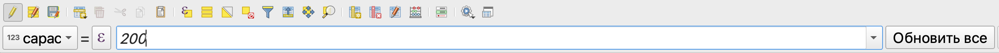

Количество населения в каждом доме рассчитаем по формуле:

$$Численность\ населения = \dfrac{Общая\ площадь}{36}=\dfrac{Площадь\ полигона*Этажность}{36}$$

В данном случае 36 метров квадратных - это средняя общая площадь квартиры, приходящаяся на одного человека.

Как рассчитать площадь здания описано по [ссылке](https://baltti.github.io/gis-masters-course/spatial.html.html).

Для тех зданий, где неизвестна этажность, ее можно заполнить как среднее значение этажности для слоя, воспользовавшись выражением:

```         
case when "Этажность" is NULL 
  then mean("Этажность")
  else "Этажность"
end
```

# Формулы для расчета

В базовом виде обеспеченность можно рассчитать по простой формуле:

$$Обеспеченность = \dfrac{Вместимость\  объекта}{Численность\  населения}$$

Численность населения может быть взята как общее число населения, так и количество населения в конкретной возрастной группе (например, количество детей).

Численность населения также может учитываться только в пределах заданной доступности сервиса.

В том случае, если обеспеченность необходимо рассчитать на 1000 человек, формула немного поменяется:

$$Обеспеченность = \dfrac{Вместимость\  объекта}{Численность\  населения}* 1000$$

Здесь в качестве множителя будет выступать то число, на которое необходимо пересчитать обеспеченность (100, 1000 и т.д.).

::: callout-tip
Доступность также может быть рассчитана в виде относительного показателя:

$$Доступность = \dfrac{Численность\ населения\ в\ пределах\ заданного\ расстояния}{Численность\  населения}*100\%$$
:::

# Расчет доступности

Для построения моделей будем использовать редактор моделей.

Открыть редактор моделей можно из строки меню *Анализ данных* $\longrightarrow$ *Конструктор моделей* или по клику на кнопку *Модели* в Панели инструментов анализа.

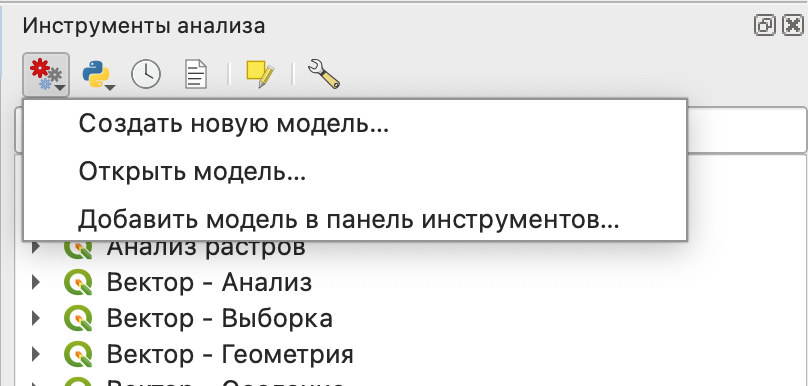{fig-align="center"}

В открывшемся новом окне основная часть предназначена для отображения модели в графическом виде, слева панель данных и алгоритмов (переключаются по вкладкам внизу панели), свойства и переменные модели, а также история команд.

{fig-align="center"}

В качестве доступных вам алгоритмов вы можете использовать все инструменты, которые есть в вашей панели инструментов анализа в основном окне программы.

## Входные данные

В первую очередь зададим для нашей модели входные данные. В нашем случае все входные данные будут представлены в виде векторных слоев:

- здания - обязательный параметр, полигоны;

- сервисы - обазятельный параметр, полигоны.

Обязательный параметр - это тот, без включения которого в исходные данные запуск модели осуществляться не будет.

::: callout-warning
Желательно называть входные данные буквами английского алфавита, так как иногда они могут не добавляться в модель или работать некорректно при использовании кириллицы.
:::

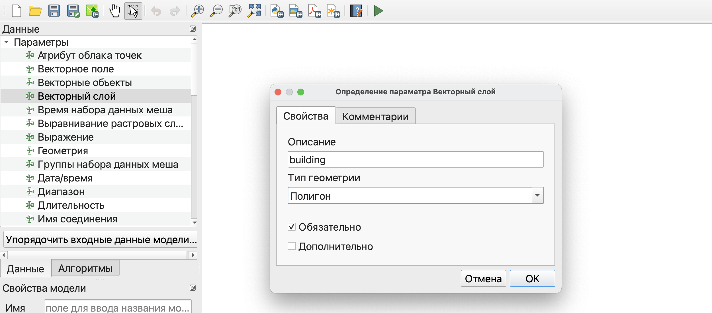{fig-align="center" width="2042"}

После добавления входных данных вы увидите их в рабочем пространстве модели.

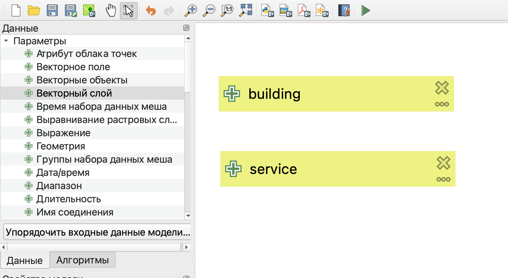{fig-align="center" width="1462"}

При необходимости вы можете передвигать элементы модели так, чтобы их было лучше видно, и масштабировать изображение элементов в рабочем пространстве.

## Построение модели расчета доступности

Для расчета доступности сервиса в первую очередь необходимо построить зоны обслуживания. Здесь мы воспользуемся буферными зонами для их построения.

Размер буферных зон будет определяться градостроительными нормативами:

- 300 метров для детских садов;

- 500 метров для школ.

Однако, чтобы строить буферные зоны в метрических единицах измерения, сначала необходимо перепроецировать слой в плоскую прямоугольную систему координат.

Проще всего воспользоваться системой координат из семейства UTM или одной из систем из группы систем координат Гаусса-Крюгера (они аналогичны, отличаются только нумерацией зон).

Чтобы рассчитать номер зоны для UTM системы координат вы можете воспользоваться калькулятором по [ссылке](https://www.latlong.net/lat-long-utm.html).

На вкладке *Алгоритмы* найдем нужный нам инструмент - *Перепроецировать слой* и укажем его параметры в открывшемся окне.

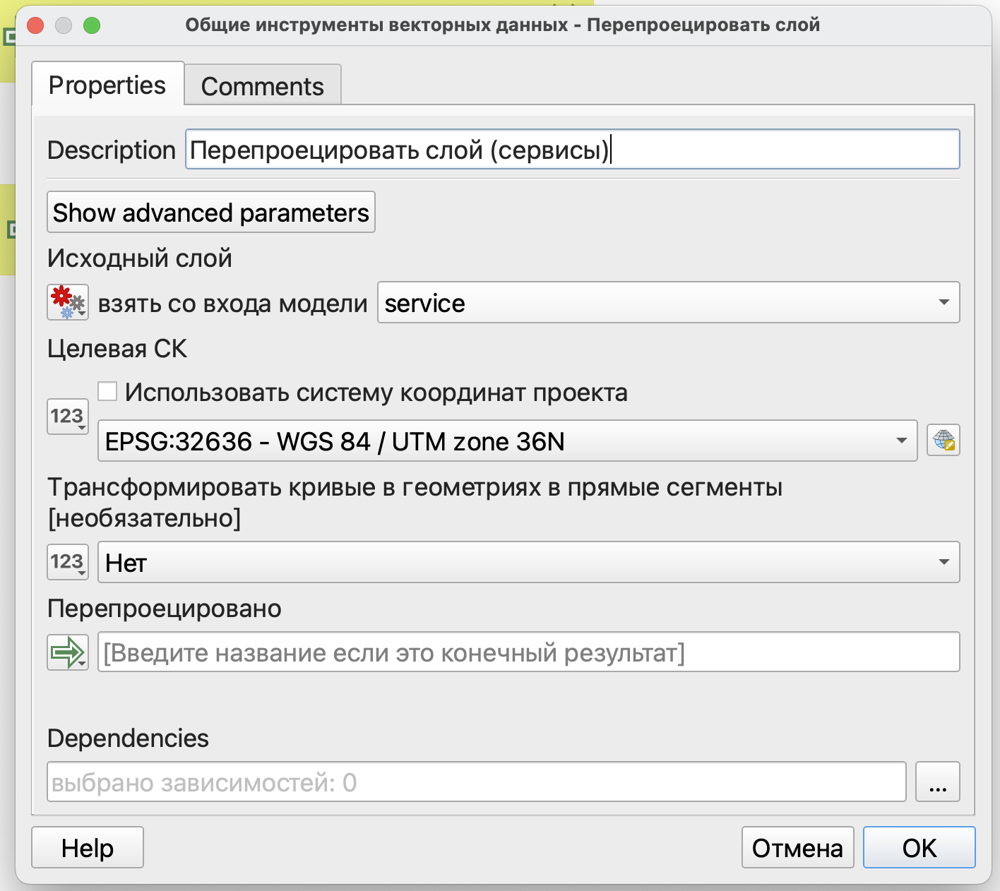{fig-align="center" width="898"}

Аналогично добавим перепроецирование для зданий.

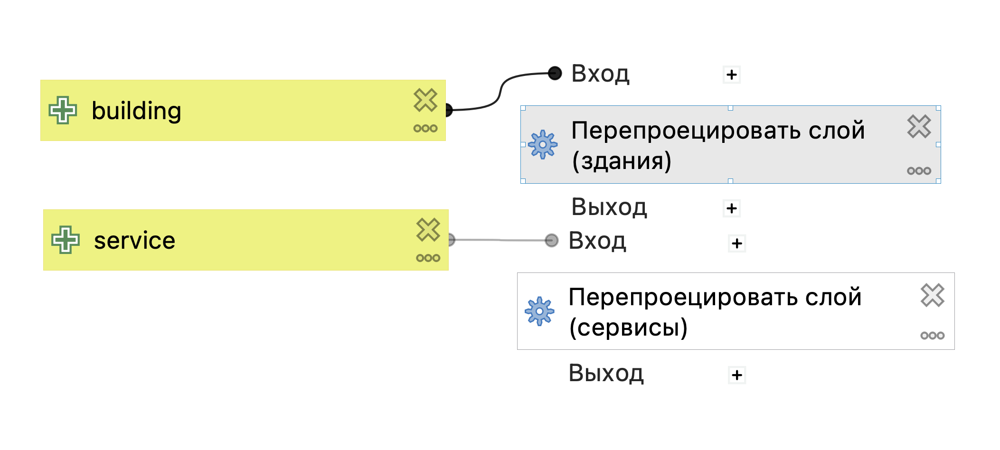{fig-align="center" width="1777"}

Следующим этапом построим буферные зоны для объектов сервиса. Для этого найдем инструмент *Буферизация*. Так как мы здесь будем использовать не исходные данные, а результат выполнения перепроецирования, то по нажатию на кнопку 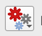{width="58"} следует выбрать пункт *Вывод алгоритма*, после чего выбрать результат перепроецирования для объектов сервиса.

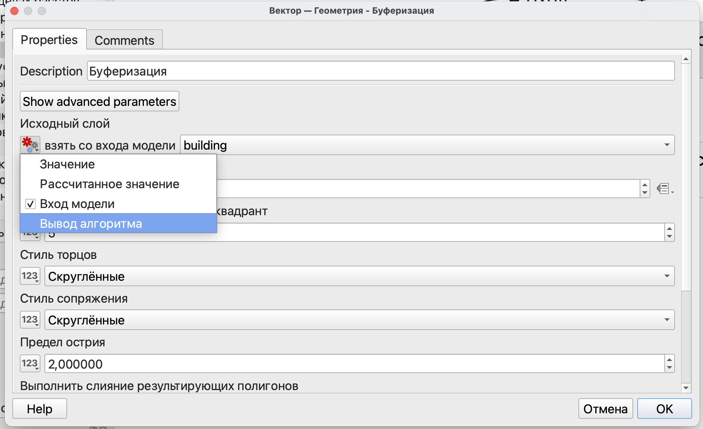

Далее необходимо указать расстояние - радиус обслуживания сервиса.

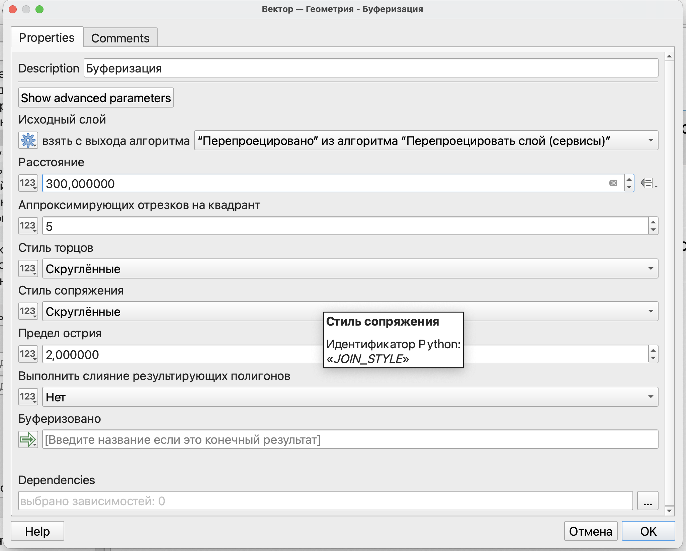

На следующем этапе нужно рассчитать количество населения, попавшее в радиус доступности.

В данном случае пример будет показан на основе инструмента *Объединение атрибутов по расположению (сводка)*, но вы также можете воспользоваться калькулятором полей и выражением аналогично тому, как мы это делали в прошлом семестре.

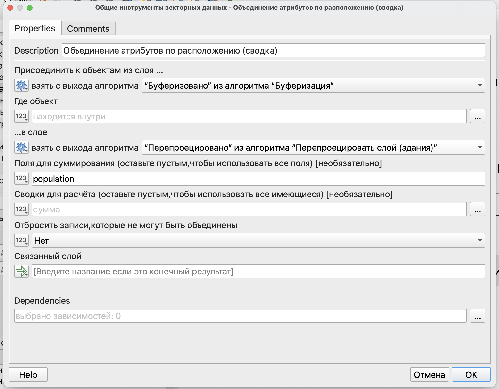{fig-align="center" width="1280"}

На последнем этапе составим выражение для расчета процента населения, которое находится в пределах радиуса доступности от сервиса, с использованием калькулятора полей.

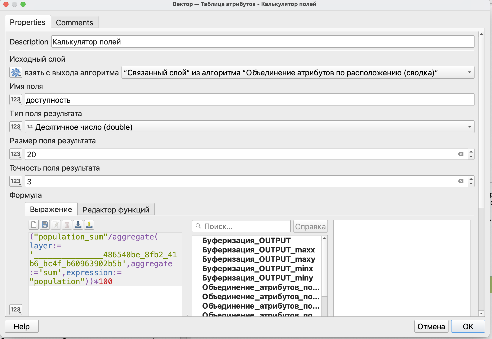

Итоговая модель будет выглядеть, как показано на рисунке ниже.

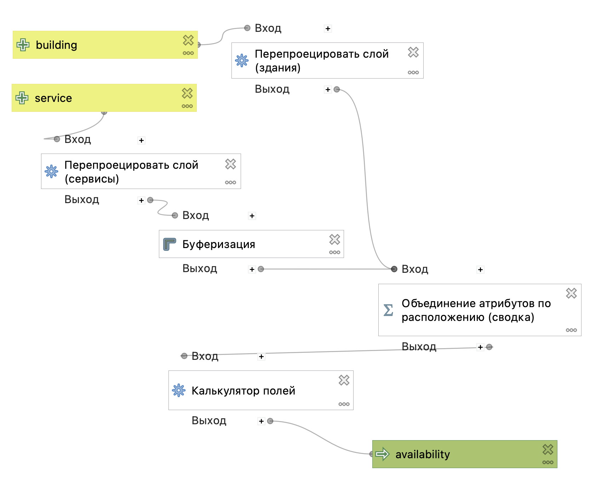{fig-align="center" width="1219"}

# Расчет обеспеченности

Полученную модель можно дополнить расчетом обеспеченности.

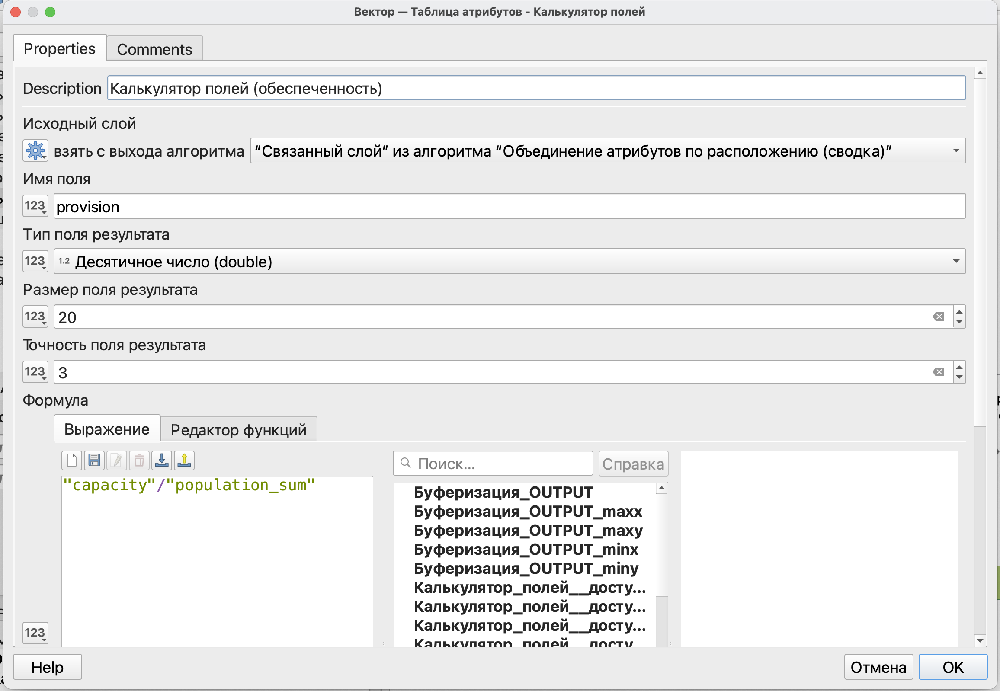

Ваша геомодель может иметь столько результатов, сколько вы посчитаете нужным.

При необходимости каждый этап расчета может быть выведен как самостоятельный результат.

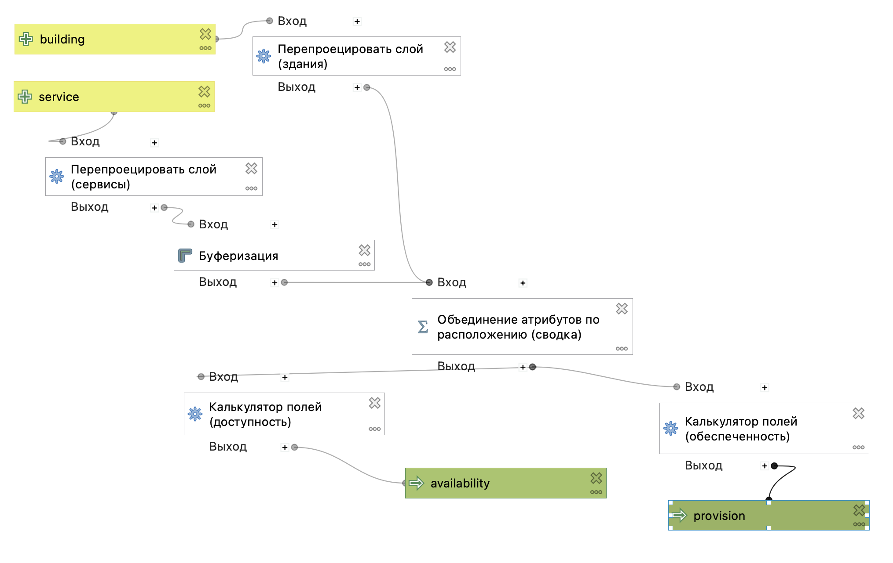
