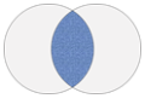
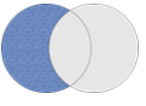
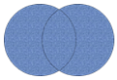
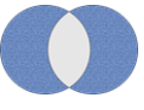

::: callout-important
В этом разделе и далее мы будем использовать преимущественно слой в системе координат UTM в нужной вам зоне.
:::

# Расчет площадей объектов

Для расчета площади зданий воспользуемся калькулятором полей в таблице атрибутов.

::: callout-note
## Напоминание

Таблица атрибутов может быть открыта из контекстного меню слоя.

{fig-align="center" width="526"}
:::

::: callout-important
Расчет площади мы будем осуществлять в том слое, который вы получили по итогам перепроецирования: слой в системе координат UTM.
:::

В открывшейся таблице атрибутов вы увидите собственную панель инструментов, на которой вам нужен калькулятор полей.

{fig-align="center" width="2158"}

В открывшемся окне калькулятора полей вам нужно создать новое поле с типом данных "десятичное число", в которое будет записан ваш результат.

Для расчета площади необходима будет одна из функций из группы **Геометрия**: `area()`.

{fig-align="center" width="1489"}

Само выражение:

```         
area ($geometry)
```

Что значит аргумент `$geometry` в скобках?

Это говорит о том, что для расчета будет использована не какая-то конкретная геометрия одного объекта, а все геометрии слоя.

::: callout-important
Обратите внимание, что у нас есть две функции для расчета площади:

-   `$area` - расчет площади осуществляется в *системе координат проекта на эллипсоиде*;

-   `area()` - расчет площади осуществляется в *системе координат слоя на плоскости*.

Мы используем здесь второй вариант, так как нам необходим расчет именно в системе координат слоя. Для этого мы его и перепроецировали.
:::

В результате вычисления вы получите новое поле, в которое будет записана площадь.

{fig-align="center" width="961"}

::: callout-note
В нашем случае площадь будет рассчитана в квадратных метрах, так как мы использовали систему координат слоя, в которой единицами измерения являются метры.

Это площадь застройки здания, то есть площадь по контуру первого этажа.
:::

::: callout-tip
Вы можете аналогично рассчитать периметр здания, воспользовавшись функцией `perimeter`.

Общая площадь здания может быть рассчитана как произведение уже рассчитаной вами площади и количества этажей.

{fig-align="center" width="728"}
:::

::: callout-note
Вы можете указать это выражение в свойствах слоя в пункте *Формы полей*, тогда при создании нового объекта площадь для него будет рассчитаваться автоматически.

{fig-align="center" width="1253"}

Это будет работать для любого вашего вычисляемого поля.
:::

::: callout-tip
Для простоты вычислений вы также можете воспользоваться модулем **Calculate geometry**.

Он будет доступен в контекстном меню слоя.

{fig-align="center" width="695"}

Модуль позволяет вычислять основные геометрические параметры без использования выражений и калькулятора полей.

{fig-align="center" width="1037"}

Кроме того, здесь вы можете в явном виде выбирать в какой системе координат и как осуществлять вычисления (на плоскости или на эллипсоиде).
:::

# Создание буферных зон

Буферная зона - это область на карте, каждая точка внутри которой находится в пределах заданного расстояния от исходного объекта.

{fig-align="center" width="1576"}

::: callout-caution
Буферные зоны - это один из тех инструментов, которые зависимы от системы координат исходного слоя. То есть размер буфера может быть задан только в единицах измерения слоя.
:::

Для создания буферных зон есть одноименный инструмент *Буферизация* в панели инструментов анализа.

{fig-align="center" width="856"}

::: callout-tip
Как видите, у нас есть несколько очень похожих инструментов, мы с вами будем пользоваться самым простым из них.

Что же делают остальные?

-   буфер переменной ширины - размер буферной зоны будет зависеть от величины какого-то показателя;

-   множественный буфер - создание сразу нескольких буферных зон с определенным шагом по расстоянию;

-   конические буферы (на самом деле клиновидные) - буфер для линейного объекта с разными значениями размера в начале и конце линии;

-   односторонний буфер - создание буфера только с одной стороны линейного объекта;

-   создать клиновидные буферы - создание буферов в форме сектора круга от точечных объектов.
:::

{fig-align="center" width="574"}

{fig-align="center" width="574"}

# Пространственное агрегирование

::: callout-note
Возможность пространственного агрегирования может быть реализована как минимум двумя способами: с использованием инструментов панели анализа и с испольованием функции агрегирования в калькуляторе полей.

В панели инструментов анализа есть две функции: *Объединение атрибутов по расположению* и *Объединение атрибутов по расположению (сводка*). Первая из них присваивает значение атрибута одних векторных объектов другим на основе их взаимного расположения относительно друг друга. Например, у нас есть слой со зданиями и слой с магазинами, у которых есть атрибут с названием, мы можем с использованием этой функции присвоить зданию название магазина, который в нем расположен.

Сводка позволяет получить не просто значение атрибута, а его статистическую сводку (среднее, медиану, максимальное и минимальное значения и прочее).
:::

# Оверлейные операции

+-------------------------+--------------------------------------------------------------------------------------------------------------------------------------------------------------------------+---------------------+--------------------------------------+
| Название                | Описание                                                                                                                                                                 | Логический оператор | Графическое представление            |
+-------------------------+--------------------------------------------------------------------------------------------------------------------------------------------------------------------------+---------------------+--------------------------------------+
| Пересечение             | Результат включает в себя общие части объектов разных слоев.                                                                                                             | AND                 |  |
|                         |                                                                                                                                                                          |                     |                                      |
|                         | Например, какие области попадают в зону затопления и зону застройки                                                                                                      |                     |                                      |
+-------------------------+--------------------------------------------------------------------------------------------------------------------------------------------------------------------------+---------------------+--------------------------------------+
| Разница                 | Результат включет в себя только части объектов одного слоя, не совпадающие с объектами другого слоя.                                                                     | NOT                 |   |
|                         |                                                                                                                                                                          |                     |                                      |
|                         | Например, какие области попадают в зону затопления, но не попадают в зону застройки?                                                                                     |                     |                                      |
+-------------------------+--------------------------------------------------------------------------------------------------------------------------------------------------------------------------+---------------------+--------------------------------------+
| Объединение             | Результатом будут являться части объектов обоих слоев, как совпавшие, так и нет. Другими словами результирующие объекты будут соответствовать хотя бы одному из условий. | OR                  |  |
|                         |                                                                                                                                                                          |                     |                                      |
|                         | В этом случае дополнительно происходит рассечение объектов одного слоя объектами другого слоя.                                                                           |                     |                                      |
|                         |                                                                                                                                                                          |                     |                                      |
|                         | Например, какие области попадают или в зону затопления или в зону застройки.                                                                                             |                     |                                      |
+-------------------------+--------------------------------------------------------------------------------------------------------------------------------------------------------------------------+---------------------+--------------------------------------+
| Симметрическая разность | Результат будет включать в себя несовпадающие части объектов разных слоев.                                                                                               | XOR                 |  |
|                         |                                                                                                                                                                          |                     |                                      |
|                         | Например, какие области не попадут ни в зону затопления, ни в зону застройки?                                                                                            |                     |                                      |
+-------------------------+--------------------------------------------------------------------------------------------------------------------------------------------------------------------------+---------------------+--------------------------------------+
