::: callout-important
В этом разделе и далее мы будем использовать преимущественно слой в системе координат UTM в нужной вам зоне.
:::

# Расчет площадей объектов

Для расчета площади зданий воспользуемся калькулятором полей в таблице атрибутов.

::: callout-note
## Напоминание

Таблица атрибутов может быть открыта из контекстного меню слоя.

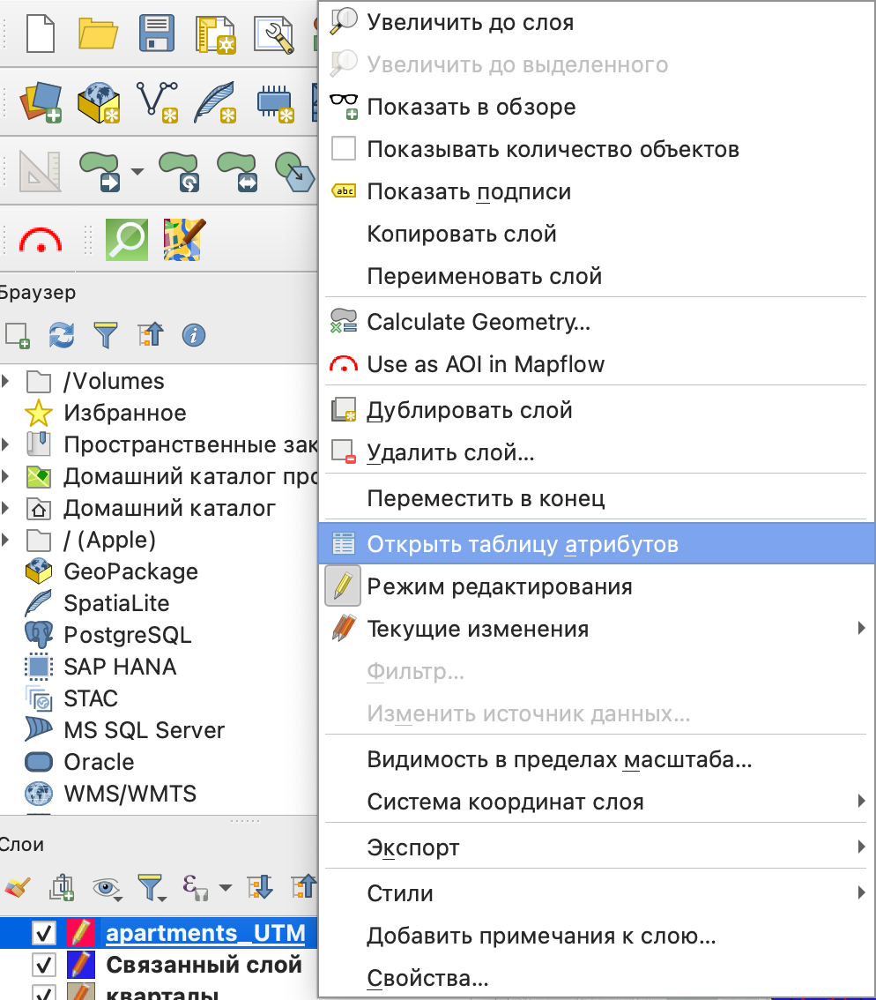{fig-align="center" width="526"}
:::

::: callout-important
Расчет площади мы будем осуществлять в том слое, который вы получили по итогам перепроецирования: слой в системе координат UTM.
:::

В открывшейся таблице атрибутов вы увидите собственную панель инструментов, на которой вам нужен калькулятор полей.

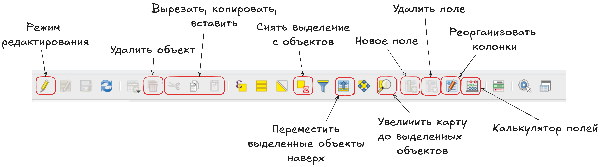{fig-align="center" width="2158"}

В открывшемся окне калькулятора полей вам нужно создать новое поле с типом данных "десятичное число", в которое будет записан ваш результат.

Для расчета площади необходима будет одна из функций из группы **Геометрия**: `area()`.

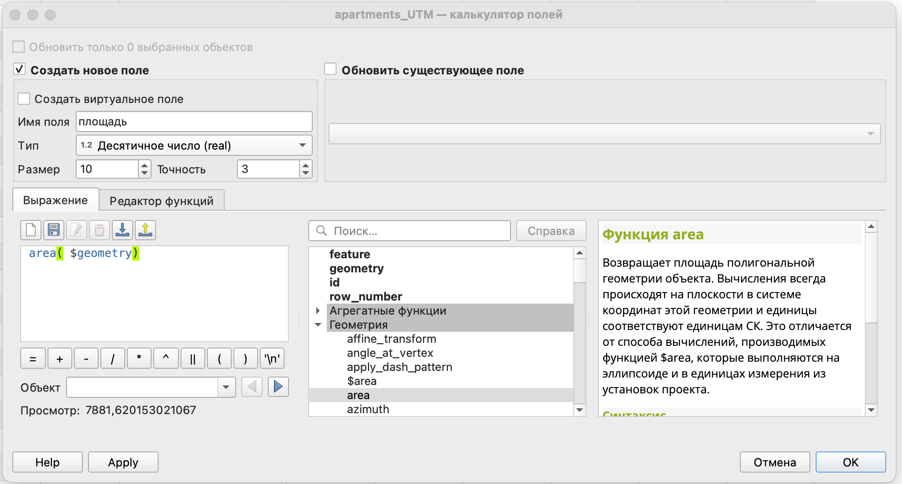{fig-align="center" width="1489"}

Само выражение:

```         
area ($geometry)
```

Что значит аргумент `$geometry` в скобках?

Это говорит о том, что для расчета будет использована не какая-то конкретная геометрия одного объекта, а все геометрии слоя.

::: callout-important
Обратите внимание, что у нас есть две функции для расчета площади:

-   `$area` - расчет площади осуществляется в *системе координат проекта на эллипсоиде*;

-   `area()` - расчет площади осуществляется в *системе координат слоя на плоскости*.

Мы используем здесь второй вариант, так как нам необходим расчет именно в системе координат слоя. Для этого мы его и перепроецировали.
:::

В результате вычисления вы получите новое поле, в которое будет записана площадь.

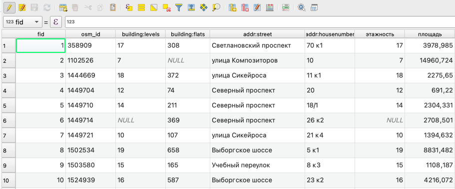{fig-align="center" width="961"}

::: callout-note
В нашем случае площадь будет рассчитана в квадратных метрах, так как мы использовали систему координат слоя, в которой единицами измерения являются метры.

Это площадь застройки здания, то есть площадь по контуру первого этажа.
:::

::: callout-tip
Вы можете аналогично рассчитать периметр здания, воспользовавшись функцией `perimeter`.

Общая площадь здания может быть рассчитана как произведение уже рассчитаной вами площади и количества этажей.

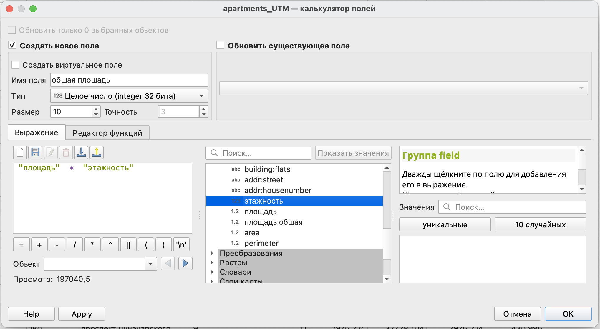{fig-align="center" width="728"}
:::

::: callout-note
Вы можете указать это выражение в свойствах слоя в пункте *Формы полей*, тогда при создании нового объекта площадь для него будет рассчитаваться автоматически.

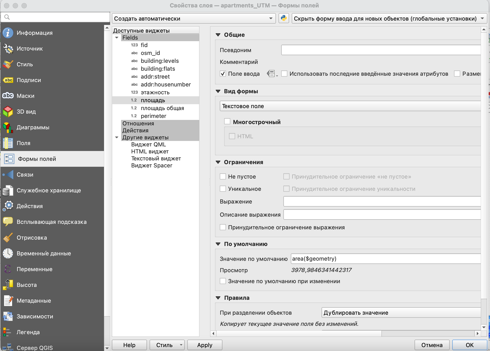{fig-align="center" width="1253"}

Это будет работать для любого вашего вычисляемого поля.
:::

::: callout-tip
Для простоты вычислений вы также можете воспользоваться модулем **Calculate geometry**.

Он будет доступен в контекстном меню слоя.

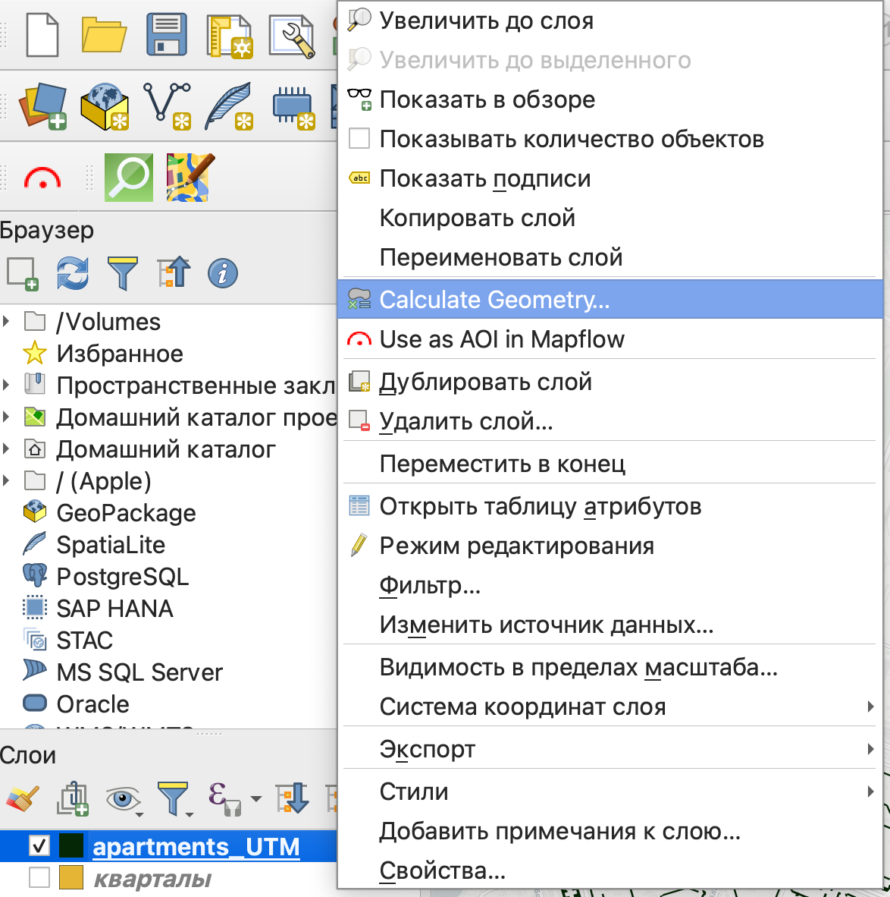{fig-align="center" width="695"}

Модуль позволяет вычислять основные геометрические параметры без использования выражений и калькулятора полей.

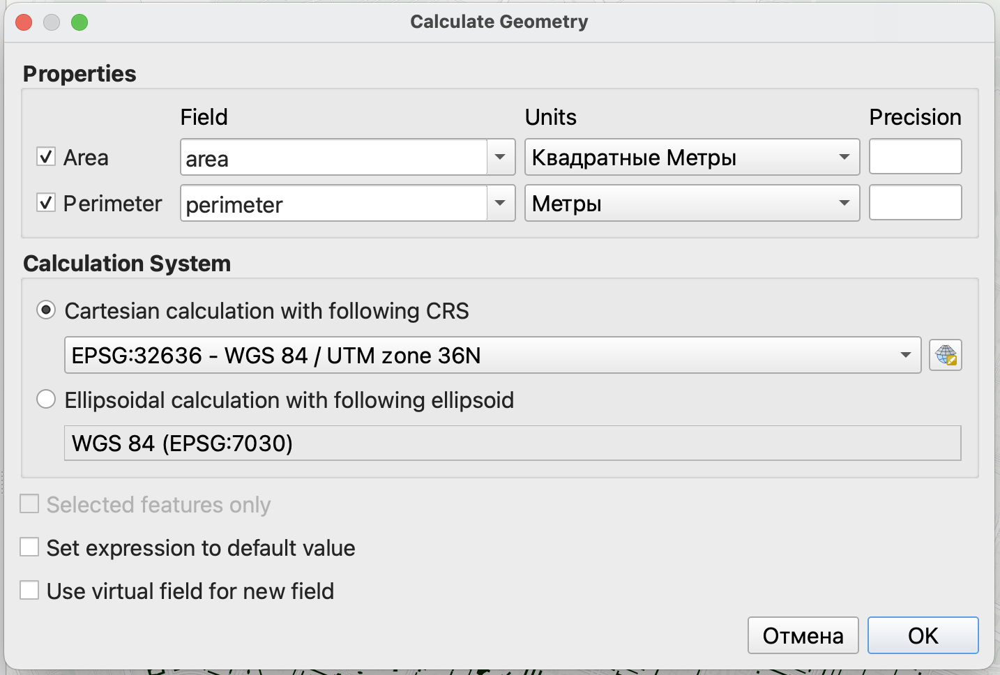{fig-align="center" width="1037"}

Кроме того, здесь вы можете в явном виде выбирать в какой системе координат и как осуществлять вычисления (на плоскости или на эллипсоиде).
:::

# Создание буферных зон

Буферная зона - это область на карте, каждая точка внутри которой находится в пределах заданного расстояния от исходного объекта.

{fig-align="center" width="1576"}

::: callout-caution
Буферные зоны - это один из тех инструментов, которые зависимы от системы координат исходного слоя. То есть размер буфера может быть задан только в единицах измерения слоя.
:::

Для создания буферных зон есть одноименный инструмент *Буферизация* в панели инструментов анализа.

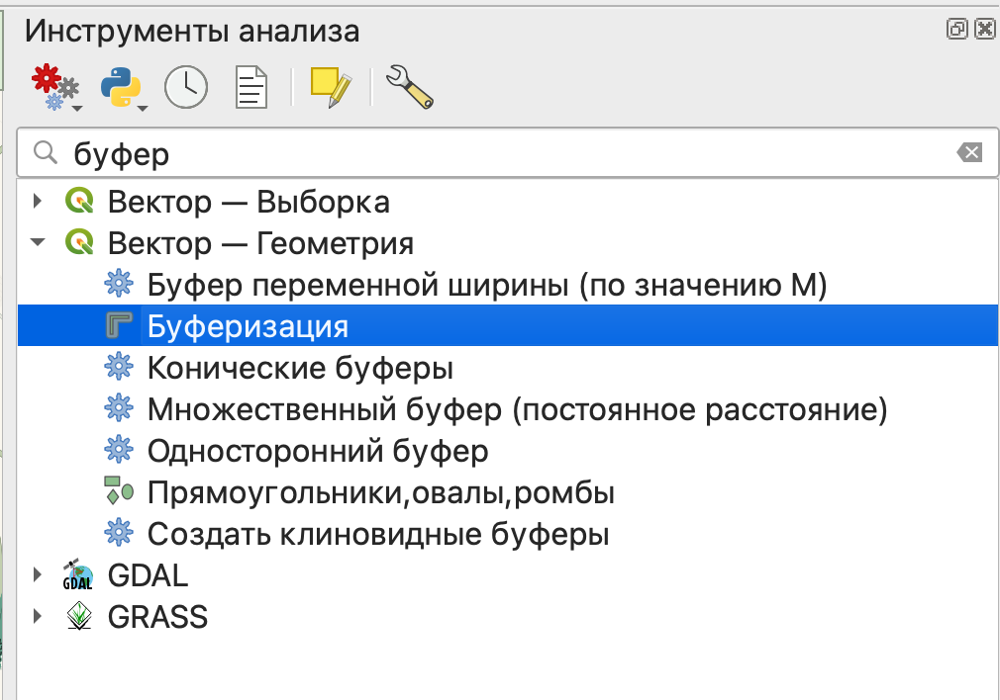{fig-align="center" width="856"}

::: callout-tip
Как видите, у нас есть несколько очень похожих инструментов, мы с вами будем пользоваться самым простым из них.

Что же делают остальные?

-   буфер переменной ширины - размер буферной зоны будет зависеть от величины какого-то показателя;

-   множественный буфер - создание сразу нескольких буферных зон с определенным шагом по расстоянию;

-   конические буферы (на самом деле клиновидные) - буфер для линейного объекта с разными значениями размера в начале и конце линии;

-   односторонний буфер - создание буфера только с одной стороны линейного объекта;

-   создать клиновидные буферы - создание буферов в форме сектора круга от точечных объектов.
:::

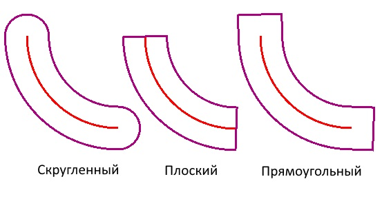{fig-align="center" width="574"}

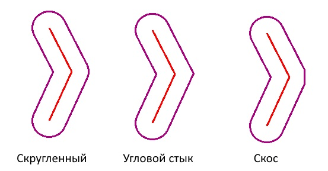{fig-align="center" width="574"}

В качестве размера буферной зоны мы воспользуемся основным градостроительным нормативом доступности для школ - 500 метров до жилых зданий.

Если вы использовали другие объекты, то вы можете взять другое расстояние.

Например, для детских садов зона доступности - 300 метров, для поликлиник - 1000 метров.

Для объектов коммерческой инфраструктуры нормативов нет, но вы можете взять свое произвольное значение.

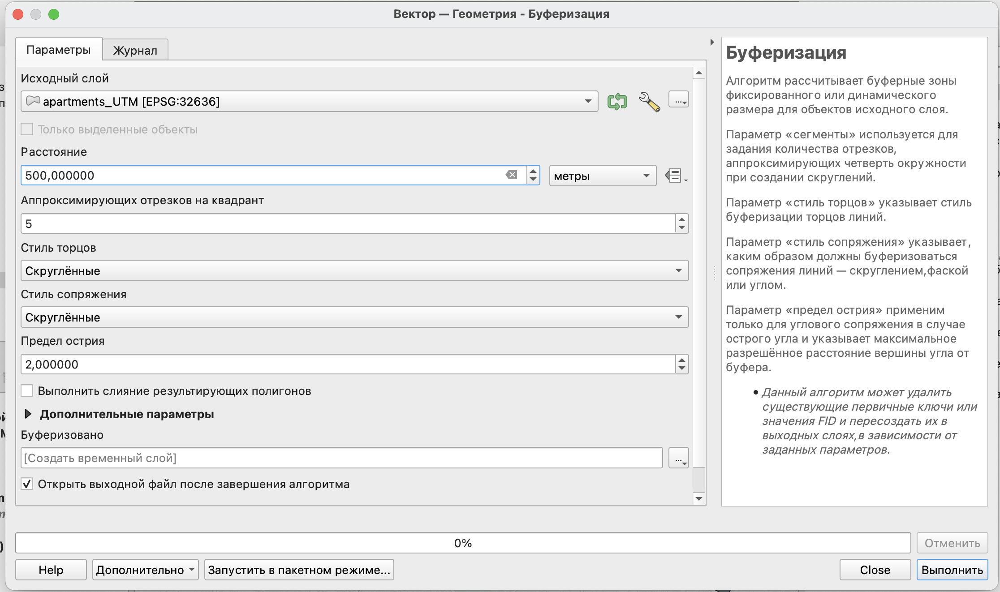{fig-align="center" width="1520"}

Так как в нашем случае буферные зоны строятся для точечных объектов, то основным параметром будет расстояние - размер зоны.

Также роль будет играть параметр *Выполнить слияние результирующих полигонов*: при его выборе все полученные полигоны будут объединены в один объект.

Если вы хотите сразу сохранить свой слой без создания временного файла, то вы можете нажать на кнопку 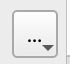{width="55"} и выбрать пункт *Сохранить в файл*, после чего выбрать место для сохранения и указать имя файла.

В итоге вы увидите новый слой в панели слоев и его отображение на карте.

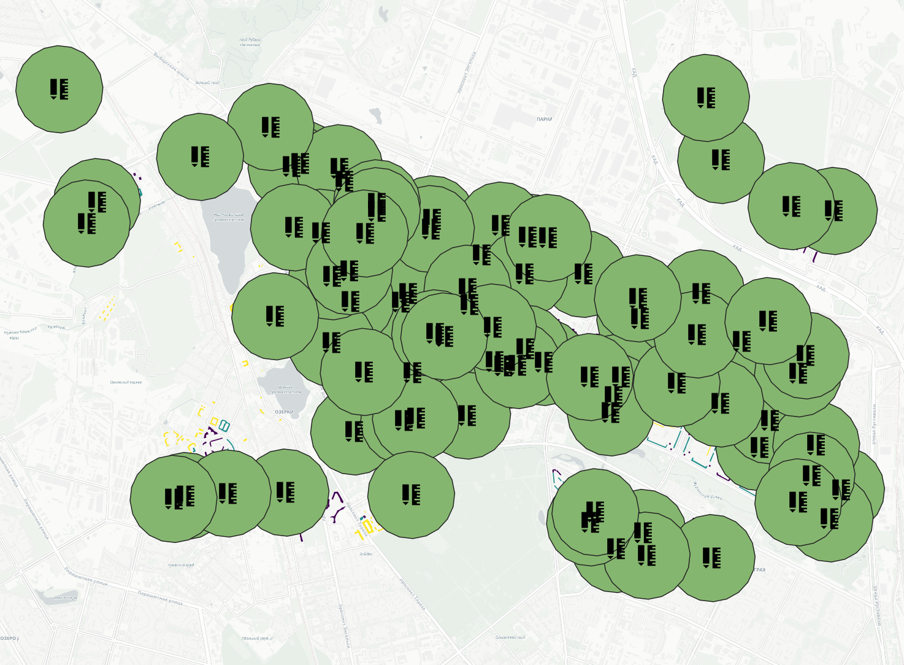{fig-align="center" width="1088"}

# Поиск объектов по расположению

## Определение зданий, попавших в границы буферных зон

Далее мы можем осуществить поиск домов, которые попадают в заданные области обслуживания.

Для поиска объектов есть группа инструментов **Вектор — Выборка**.

Часть инструментов в ней начинается со слова *Выбрать (Выделить)*, а часть - *Извлечь*. Разница между ними в том, что в первом случае объекты просто выделяются в исходном слое, а во втором - объекты, соответствующие заданным условия, извлекаются в новый слой.

Краткое описания инструментов:

-   *выбрать/извлечь по атрибуту* - поиск объектов по значению одного из атрибутов;

-   *выбрать/извлечь по выражению* - поиск объектов по значениям нескольких атрибутов одновременно;

-   *выбрать/извлечь по пространственному отношению* - поиск объектов по их расположению относительно объектов другого слоя;

-   *выделить/извлечь в пределах расстояния* - поиск объектов в пределах заданного расстояния от других объектов;

-   *случайное выделение/случайное извлечение* - случайная выборка объектов из слоя (заданного числа объектов или заданного процента объектов);

-   *случайное выделение в подмножествах/случайное извлечение в подмножествах* - сначала слой разбивается по категориям по одному из атрибутов, потом из каждой категории извлекается заданное число или заданный процент объектов.

Нам нужно определить, какие здания попадают в буферные зоны, поэтому нужно воспользоваться **выбрать\\извлечь по пространственному отношению**.

Для выбора объектов нужно сначала указать в каком слое осуществляется поиск (слой со зданиями), геометрический оператор (как объекты расположены относительно объектов другого слоя) и слой для сравнения (буферные зоны). Геометрические операторы в данном случае лучше выбирать *Пересекает* и *Находится внутри*.

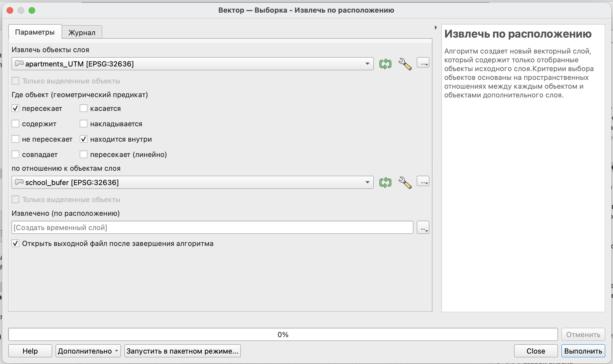{fig-align="center" width="1514"}

По результатам извлечения вы получите новый слой, который будет содержать только здания, удовлетворяющие заданным условиям.

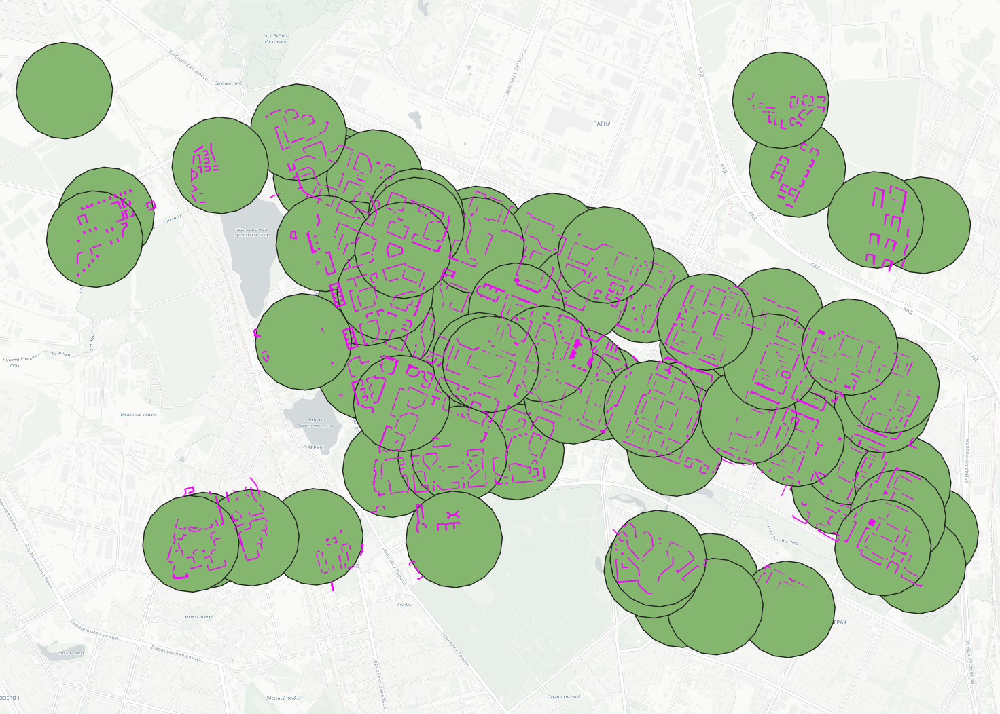{fig-align="center" width="1119"}

::: callout-tip
Инструмент *Выбрать по расположению* работает аналогично, но результатом у вас будет не просто новый слой, а выделенный набор объектов в текущем слое.
:::

::: callout-tip
Такеж вы можете попробовать найти здания в пределах заданного расстояния от школ при помощи инструментов *Выделить в пределах расстояния/Извлечение в пределах расстояния*.

Однако следует помнить, что расстояние будет определяться в системе координат проекта, поэтому будет отличаться от того, что получено при помощи буферных зон.
:::

# Пространственное агрегирование

::: callout-note
Возможность пространственного агрегирования может быть реализована как минимум двумя способами: с использованием инструментов панели анализа и с испольованием функции агрегирования в калькуляторе полей.

В панели инструментов анализа есть две функции: *Объединение атрибутов по расположению* и *Объединение атрибутов по расположению (сводка*). Первая из них присваивает значение атрибута одних векторных объектов другим на основе их взаимного расположения относительно друг друга. Например, у нас есть слой со зданиями и слой с магазинами, у которых есть атрибут с названием, мы можем с использованием этой функции присвоить зданию название магазина, который в нем расположен.

Сводка позволяет получить не просто значение атрибута, а его статистическую сводку (среднее, медиану, максимальное и минимальное значения и прочее).
:::

## Расчет количества доступных школ

Рассчитаем число доступных школ для каждого из наших зданий с использованием выражения агрегирования.

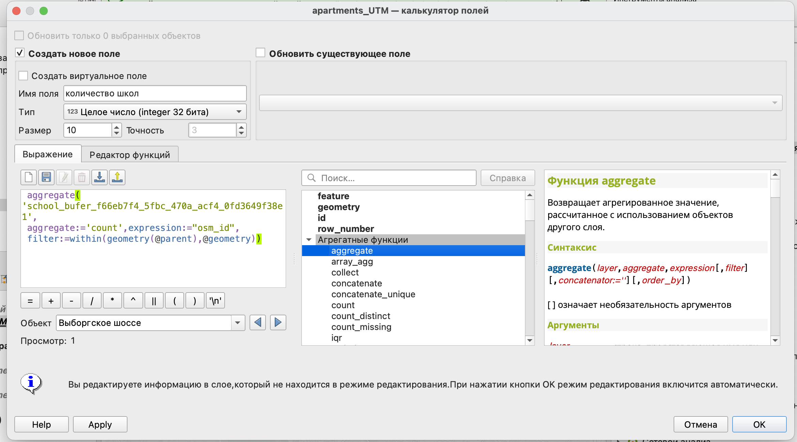{fig-align="center" width="1621"}

```         
 aggregate( 'school_bufer_f66eb7f4_5fbc_470a_acf4_0fd3649f38e1', aggregate:='count',expression:="osm_id", filter:=within(geometry(@parent),@geometry))
```

Как видите, выражение очень похоже на то, что мы уже использовали, меняются только некоторые аргументы.

Во-первых, используется другой тип агрегирования - `count`, то есть подсчет количества; во-вторых, используется другое выражение фильтрации - в этом случае мы ищем объекты исходного слоя, *попавшие внутрь буферных зон*.

По итогам расчета получен новый атрибут, в котором указано количество школ, находящееся в радиусе доступности.

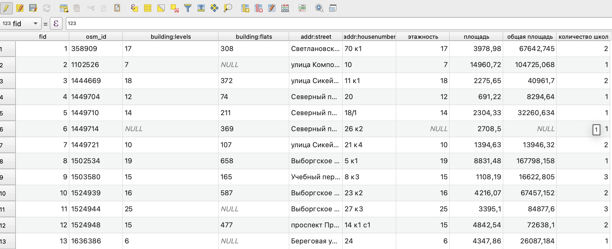{fig-align="center" width="2209"}
