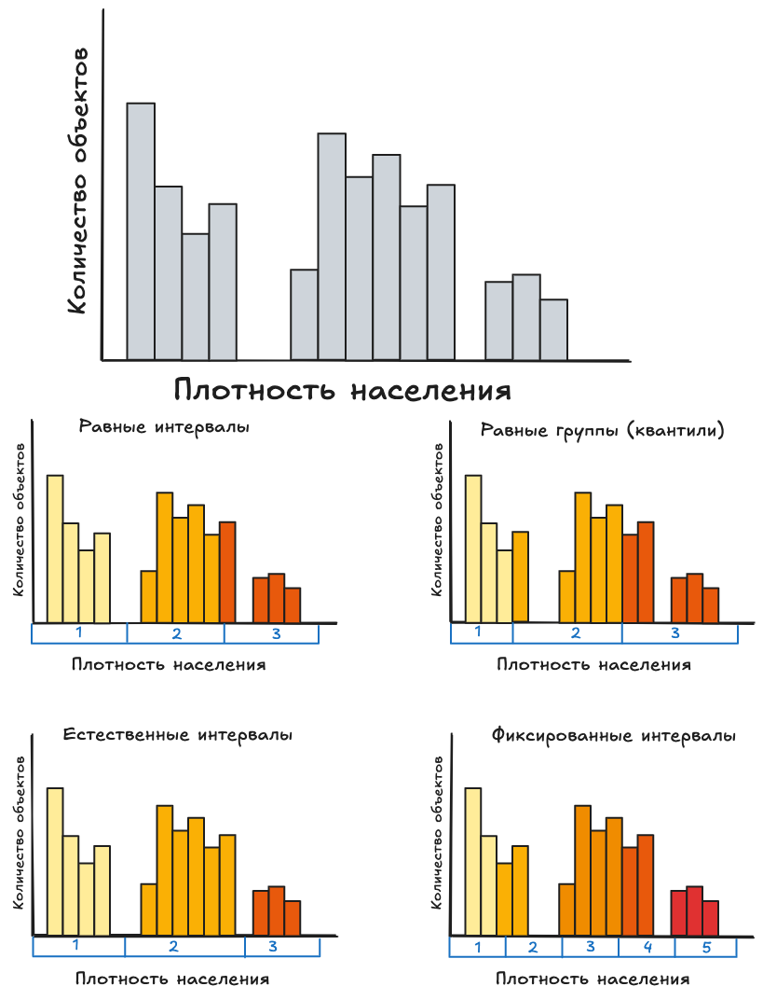
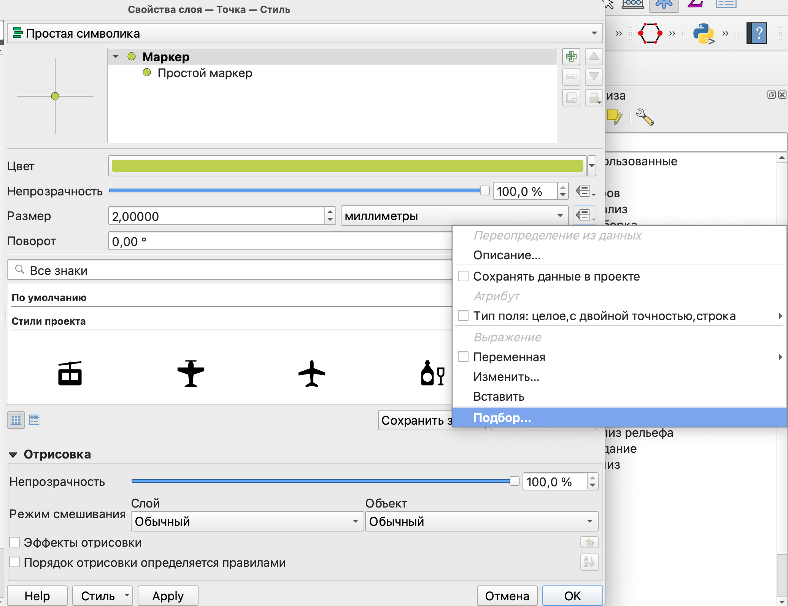
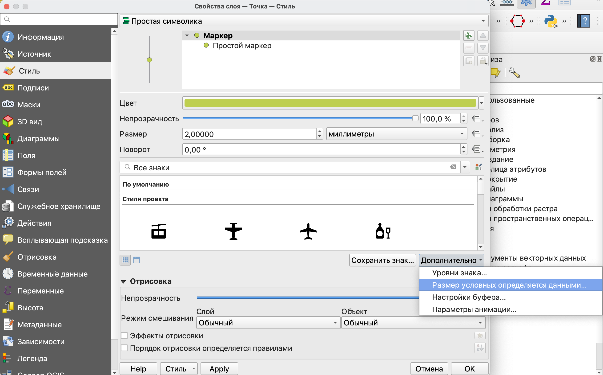

# Уровни знака

Особенностью QGIS при создании стиля того или иного слоя является то, что любой символ может быть собран послойно из различных типов слоев знака.

Такие типы слоев различны для разных видов основных геометрических примитивов (точек, линий и полигонов) аналогично типам символов.

Следует помнить, что, как и слои проекта, эти слои перекрывают друг друга в порядке их перечисления: слои, находящиеся в описании выше, перекрывают более низкие.

Для всех основных типов геометрий существует генератор геометрии, о котором будет рассказано отдельно.

## Точечные объекты

{fig-align="center"}

По умолчанию основным типом слоя здесь будет являться **простой маркер**, у которого могут быть настроены:

-   размер;

-   цвет заливки;

-   прозрачность;

-   параметры смещения от истинного положения;

-   обводка - толщина и цвет;

-   форма маркера.

    Все эти параметры могут быть заданы как в виде некоторого значения, так и переопределены на основе данных. То есть тот или иной параметр будет зависеть от значения атрибута объекта или вычисляемого выражения на основе атрибута/атрибутов.

Тип слоя *Маска* может быть использован при необходимости отрисовки точечного слоя поверх других слоев и подписей так, чтобы они его не перекрывали.

Тип слоя *Генератор геометрии* является общим для всех типов геометрий и подробно будет рассмотрен отдельно.

Прочие типы слоев точечного символа:

-   *анимированный маркер* - точечный объект, который использует анимированное изображение в формате *.gif* в качестве маркера (могут быть настроены основные размеры маркера);

-   *эллиптический маркер* - модификация простого маркера, для которого можно настроить отдельно ширину и высоту;

-   *маркер с заливкой* - еще одна модификация простого маркера, которая позволяет использовать те же типы заливки, что и для полигона;

-   *шрифтовой маркер* - маркер, внутри которого добавлен текстовый символ или текст, для которого может быть отдельно настроен шрифт и содержание текста (например, на основе выражения или атрибута, или просто введенный текст);

-   *растровый маркер* - использует растровое изображение (форматы *.png, .jpg, .bmp*) в качестве символа маркера;

-   *SVG маркер* - маркер, который использует в качестве символа векторное изображение в формате SVG (позволяет больше возможностей настройки, чем растровый маркер);

-   *маркер векторного поля* - кастомизируемый маркер, который может быть создан на основе атрибутов:

{fig-align="center"}

-   на плоскости - маркер задается параметрами по оси X и Y;

-   полярный - маркер с параметрами длины и угла поворота;

-   только высота - маркер с одним параметром высоты для отображения высоты расположения точек.

## Линейные объекты

{fig-align="center"}

Простая линия для линейных объектов похожа на простой маркер с основными параметрами настройки по цвету, толщине, прозрачности.

Для линейных объектов также как и для остальных есть один из основных типов слоев

-   *Генератор геометрии* и прочие, позволяющие настраивать различные параметры:

-   *стрелка* - линия со стрелкой на одном или обоих концах;

-   *штрихи вдоль линии* - линия, которая отрисовывается короткими отрезками перпендикулярными ее направлению через установленный интервал;

-   *интерполированная линия* - линия, которая может менять цвет и толщину от одного конца к другому;

-   *линия с градиентной заливкой* - линия, для которой переход в заливке происходит перпендикулярно ее направлению;

-   *маркерная линия* - линия, составленная из маркерных символов;

-   *линия из растров* - линия, составленная из растровых маркеров.

## Полигональные/площадные объекты

{fig-align="center"}

Наибольшую свободу в настройке допускают полигональные символы, так как они могут быть отрисованы как полигоны с настраиваемой заливкой, так и в некоторых типах слоев как маркеры или обводки.

Типом слоя по умолчанию здесь, как и в предыдущих типах объектов будет являться *Простая заливка*, а *Генератор геометрии* - общим типом стиля, который подробнее рассмотрен отдельно.

Некоторые из прочих типов слоев для полигонов основаны на маркерах, а некоторые на линейных стилях.

Рассмотрим прочие типы слоев для полигональных объектов:

-   *Отрисовка центроидов* - вместо полигона отрисовывается только маркер в его геометрическом центре;

-   *Градиентная заливка* - заливка полигона заданным и настроенным градиентом, который может быть настроен как на основе двух цветов, так и на основе определенного цветового ряда с различными настройками перехода;

{fig-align="center"}

-   *Заливка штриховкой* - заливка полигона происходит не сплошным цветов, а линейной штриховкой, для которой могут быть настроены как параметры линии штриховки, так и параметры частоты и поворота штрихов;

    {fig-align="center"}

-   *Заливка точками* - полигон заполняется маркерами точечных объектов с регулярным расположением;

{fig-align="center"}

-   *Заливка маркерами со случайным размещением* - полигон заполняется заданным числом маркеров со случайным расположением;

-   *Заливка растром* - в качестве заливки используются не параметры цвета, а готовое растровое изображение;

-   *Заливка SVG узором* - полигон заполняется векторным изображением в формате SVG (как и в случае с маркером SVG дает значительно больше параметров настройки, чем простое заполнение растровым изображением);

-   *Заливка градиентом из центра* - полигон заливается градиентом цветов, который выстраивается от центра к границе (в отличие от просто градиентной заливки, где градиент распространяется на объект в целом);

{fig-align="center"}

-   *Обводка* - тип слоя полигонального объекта, построенный на основе линейных типов слоев, который отображает только внешний контур объекта (подробнее о них сказано выше):

    -   *Стрелка*;

    -   *Штрихи вдоль линии*;

    -   *Интерполированная линия;*

    -   *Линия с градиентной заливкой;*

    -   *Маркерная линия*;

    -   *Линия из растров;*

    -   *простая линия*.

# Классификация числовых переменных

Самые широко применяемые методы классификации в геоинформационных системах:

-   *Равное количество (квантиль)*: в каждом классе будет одинаковое количество элементов;
-   *Равный интервал*: каждый класс будет иметь одинаковый размер.
-   *Стандартное отклонение*: классы строятся в зависимости от стандартного отклонения значений.
-   *Фиксированный интервал*: каждый класс будет иметь фиксированный диапазон значений (например, при значениях от 1 до 16 и размере интервала 4 классами будут 1-4, 5-8, 9-12 и 13-16).
-   *Логарифмическая шкала*: подходит для данных с широким диапазоном значений.
-   *естественные интервалы* (Natural Breaks (Jenks)): дисперсия внутри каждого класса минимизируется, а дисперсия между классами максимизируется.
-   *форматированные отступы*: вычисляет последовательность из примерно n+1 равномерно распределенных "красивых" значений, которые покрывают диапазон значений x. Значения выбираются таким образом, чтобы они были в 1, 2 или 5 раз больше 10.

{fig-align="center"}

В методе **равных интервалов** длина интервала рассчитывается по формуле: $$Интервал = \frac{max X_i - min X_i}{ Количество \ интервалов} $$

**Метод квантилей** использует несколько другой подход: вместо деления всего диапазона на интервалы здесь на группы равного размера делится все количество объектов.

$$Количество\ объектов\ в\ группе  = \frac{Всего\ объектов}{ Количество \ интервалов} $$

::: callout-important
При использовании равных интервалов может получиться так, что какие-то из них будут пустыми.

При применении квантилей вы не получите пустых интервалов. Как правило, этот метод рекомендуется при наличии значительных выбросов, если вам необходимо уменьшить их влияние.

Но следует помнить, что метод квантилей фактически не будет учитывать вариацию показателя внутри группы.
:::

Если исходные данные распределены по нормальному закону или необходимо показать отклонение от среднего значения, то оптимальным может быть метод на основе стандартного отклонения: $$Интервал = n \cdot\sigma$$

$n$ - номер интервала, $\sigma$ - стандартное отклонение: $$\sigma=\sqrt{\frac{\sum_{i=1}^{n} (x_i-\overline{x})^2}{N-1}} $$

где $x_i$ - величина показателя для $i-го$ объекта, $\overline{x}$ - среднее значение показателя, $N$ - общее количество объектов.

::: callout-important
Однако при использовании этого метода необходимо помнить, что будет учитываться фактически вариация от среднего, а не в рамках интервалов относительно друг друга.

Кроме того, интервалы здесь рассчитываются отдельно, что может привести к потере данных.
:::

Расчет интервалов по методу естественных интервалов происходит итеративно:

-   случайным образом разбить данные на интервалы;

-   рассчитать сумму квадратов отклонений от среднего по формуле $\sum_{i=1}^{n} (x_i-\overline{x})^2$;

-   сравнить полученные значения между классами;

-   изменить интервалы;

-   пересчитать сумму квадратов отклонений.

Процесс повторяется до тех пор, пока для каждого интервала не будет достигнуто условие $\sum_{i=1}^{n} (x_i-\overline{x})^2 \rightarrow min$.

Как понять какое количество интервалов вам нужно?

Вы можете опираться на общеизвестные теории восприятия информации, которые говорят нам о том, что кратковременная память не способна удерживать более 7 интервалов (максимум 10). Поэтому, как правило, рекомендуют использовать от 3 до 7 интервалов.

Чем больше у вас будет интервалов/категорий, тем сложнее будет вашему потенциальному зрителю.

::: callout-tip
Если вы хотите опираться на количественную методику расчета числа интервалов, можно воспользоваться распространенной формулой Стерджесса, где $n$ - количество интервалов, $N$ - число объектов:

$n = 1+|log_2 N|$ или $n = 1+|3.322 \lg N|$
:::

# Исходные данные

В качестве исходных данных для этого раздела будут использованы сведения о количестве населения по муниципальным образованиям Москвы.

Данные о количестве населения приведены на 1 января 2025 года по данным Росстата <https://77.rosstat.gov.ru/folder/64634>

Исходный слой приведен в системе координат UTM 36 зона для Северного полушария (`EPSG:32636`).

Полный датасет можно скачать по ссылке <https://disk.yandex.ru/d/zCKHvmBDnZFwkg>

::: callout-warning
В папке два файла:

-   *ao.geojson* - административные округа

-   *municipal_districts.geojson* - муниципальные округа.

Скачать можно их оба сразу, но пока понадобится только второй.
:::

# Карта пропорциональных символов

В этом типе тематических карт отображение происходит с помощью размера символов, который пропорционален величине показателя.

Для создания карты пропорциональных символов так, чтобы вам было доступно создание легенды для карты, в первую очередь следует получить точечный слой на основе полигональных объектов.

Для этого воспользуемся инструментом *Точка на поверхности* из *Панели инструментов анализа*.

Этот инструмент дублирует инструмент *Центроид* с одной небольшой разницей: в случае невыпуклого многоугольника при использовании *Центроида* точка будет лежать за пределами полигона, тогда как при использовании *Точки на поверхности* точка будет смещена внутрь.


В результате вы получите новый слой с точечными объектами, которые будут иметь те же атрибуты, что и исходные полигоны.

{fig-align="center" width="1292"}

В первую очередь следует определить размер знаков.

{fig-align="center" width="1170"}

В открывшемся окне следует указать поле, по которому размер будет задан и его значения.

{fig-align="center" width="783"}

Для того, чтобы размер символов был отображен в легенде, следует выбрать настройку *Размер условных определяется данными...*

{fig-align="center" width="1445"}

После этого вы можете настроить свою легенда и выбрать ее тип.

{fig-align="center" width="704"}

В результате вы получите свою карту с готовой легендой, которую можно использовать для оформления.

{fig-align="center" width="1280"}

::: callout-tip
Размер символов как визуальная переменная хорошо сочетается с цветом, который вы можете использовать для отображения того же показателя или другого.
:::

# Карта плотности точек

В карте плотности точек количество точек будет отображать величину показателя.

Для ее создания воспользуемся возможностью создания многослойных символов.

{fig-align="center" width="1557"}

В этом случае каждый из полигонов будет заполнен заданным количеством маркеров, которые будут размещены случайным образом.

Так как нам необходимо, чтобы количество маркеров было пропорционально количеству населения, то воспользуемся опцией переопределения показателя из данных.


В открывшемся окне воспользуемся редактором выражений.

В данном случае поделим общее количество населения на 1 000, таким образом 1 точка на карте будет соответствовать 1 000 человек, проживающих в определенном муниципальном образовании.


Рекомендуется выбирать это число таким образом, чтобы в каждом из исходных объектов было хотя бы несколько точек.

{fig-align="center" width="816"}

Обратите внимание, что вы можете настраивать стиль слоев символа независимо друг от друга.

# Фоновая картограмма

Фоновая картограмма - один из самых наиболее известных типов тематических карт, в которых показатель отображается цветом или штриховкой.

Для ее создания достаточно просто воспользоваться уже знакомым вам символом по диапазонам значений.

Однако следует помнить, что при использовании фоновых картограмм рекомендуется брать относительные значения показатей, например, вместо количества населения - плотность населения на единицу площади.

В наших исходных данных в таблице атрибутов приведено именно количество населения, поэтому необходимо перейти от него к плотности. Сделать это можно двумя способами: рассчитав плотность как отдельный атрибут с использованием калькулятора полей или воспользоваться выражением вместо конкретного атрибута при задании стиля символа.

Воспользуемся вторым способом и выражением:

```         
"population" /( area( \$geometry)/10000)
```

В этом выражении количество населения поделено на рассчитанную площадь муниципального образования, которая переведена в километры квадратные.

{fig-align="center" width="1386"}

Вы также можете выбрать градиент, который вам больше нравится, но рекомендуется использовать градиенты от светлого к темному (при светлом фоне) или от темного к светлому (при темном фоне).

{fig-align="center" width="1305"}

::: callout-tip
Если вы хотите, чтобы под вашими полигонами читалась подложка, то вы можете воспользоваться режимом смешивания.

{fig-align="center" width="734"}

{fig-align="center" width="597"}
:::

# Анаморфная карта

Анаморфная карта предполагает отображение показателя с помощью размера объекта, но, в отличие от пропорциональных символов, здесь используется исходная геометрия объектов, которая искажается пропорционально величине показателя.

::: callout-important
Следует помнить, что в анаморфной карте искажаются форма и размер объектов.
:::

В QGIS отсутствует инструмент по умолчанию для создания анаморфной карты, поэтому следует воспользоваться модулем *Cartogram3*. Этот модуль появится у вас на панели инструментов в виде значка {width="51"}.

В открывшемся окне модуля необходимо выбрать слой, для которого анаморфная карта рассчитывается, показатель и указать критерии остановки (максимальное число итераций или максимальная средняя ошибка).

::: callout-warning
Чем выше значения критерия остановки, тем сильнее будет искажение в итоговой карте.
:::

{fig-align="center" width="1033"}

На полученной карте муниципальные образования с большим количеством населения будут "раздуты", а с маленьким наоборот - уменьшены.

{fig-align="center" width="822"}

# Несмежная картограмма

Несмежная картограмма отчасти следует принципу создания анаморфной карты, то есть искажает размер объектов так, чтобы он был пропорционален величине показателя, но здесь нарушается топология объектов, то есть они перестают иметь общие границы при обзем сохранении формы объектов.

Несмежную картограмму мы создадим с использованием *Генератора геометрии*, которы позволяет создавать объекты с измененной геометрией на карте, не меняя геометрии в слоев.


Для генератора воспользуемся следующим выражением:

```         
scale( $geometry, "population"/maximum("population"), "population"/maximum("population"))
```

Это выражение масштабирует объекты, в качестве первого аргумента здесь указывается, что масштабировать, а второй и третий - это величина масштабирования по оси X и Y соответственно.

В результате вы получите слой с отмасштабированными пропорционально количеству населения муниципальными образованиями.

{fig-align="center" width="866"}

# Создание атласа

Атлас в QGIS позволяет автоматически создать несколько листов карты на основе какого-то условия группировки.

Например, мы можем сделать атлас для нашей карты с количеством населения в муниципальных образованиях, где на одном листе будет показан один район.

Для того, чтобы сделать из макета карты атлас, то есть серию карт нам необходимо условие группировки объектов, в качестве которого будет выступать административный район.

Чтобы получить слой с районами, воспользуемся инструментом *Агрегировать*.

{fig-align="center" width="1234"}

Полученный слой с районами будет добавлен на карту.

{fig-align="center" width="700"}

Создадим новый макет, в котором с помощью кнопки *Настройки атласа* {width="53"} создадим атлас.

{fig-align="center" width="628"}

Страницы атласа в данном случае будут создаваться по районам.

Для создания страниц атласа не обязательно, чтобы слой, по которому они создаются был видимым в проекте.

Просмотр страниц атласа включается по кнопке *Предпросмотр атласа* {width="52"}.

Для того, чтобы масштаб карты подстраивался под содержимое настроим масштаб под объекты, определяющие страницы нашего атласа. Для этого откроем свойства карты и найдем настройку масштаба атласа. Нужно установить настройку масштаба атласа по размерам объектов с полем. Так карта будет автоматически масштабироваться на каждом листе так, чтобы на ней размещался только один из районов.

{fig-align="center" width="509"}

В итоге каждый лист будет центрироваться на одном из районов, а масштаб будет подбираться так, чтобы район целиком помещался на карту.

Для того, чтобы район был очевиднее на листе, настроим стиль объектов так, чтобы район листа был обведен более толстым контуром.

Вернемся в основное окно программы, и настроим стиль обводки на основе выражения:

```         
if ( @atlas_pagename =  "NAME"  ,1, 0.3)
```

{fig-align="center" width="1487"}


Это выражение с условием "если", в котором в качестве аргументов передаются:

-   условие;

-   толщина обводки в том случае, если условие выполнено;

-   толщина обводки, если условие не выполнено.

Что же значит переменная `@atlas_pagename`? Эта переменная указывает на то, что для задания стиля здесь нужно использовать тот район, на странице которого сейчас открыт наш атлас.

{fig-align="center" width="1600"}

{fig-align="center" width="918"}

# Генератор геометрии
